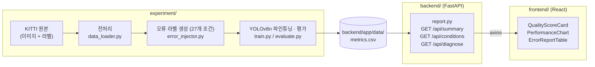
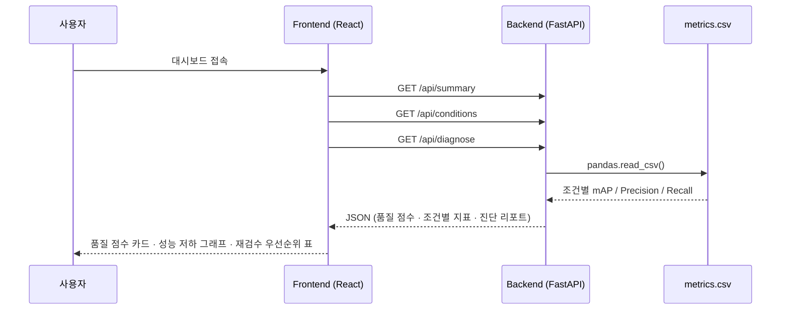

# AIDA — AI 데이터 품질 진단 (연구 프로토타입)

> 이 프로젝트가 처음이라면 [`docs/README.md`](docs/README.md)부터 읽을 것.
> 프로젝트 배경, 핵심 기술 원리(특허 연계), 아키텍처, 실험 설계, 의사결정 이유가
> 전부 문서화되어 있다. 개발 이력은 [`CHANGELOG.md`](CHANGELOG.md), 새 세션에서
> 이어받을 때는 [`docs/09-getting-started.md`](docs/09-getting-started.md) 참고.

## 이게 뭔가

**AIDA (AI Data Assurance)** — 객체탐지 AI 학습데이터의 바운딩박스 라벨 오류를
자동 진단하고 품질을 인증하는 B2B 데이터 품질검증 플랫폼.

객체탐지 모델은 사람이 그린 바운딩박스 라벨을 정답으로 학습한다. 그런데 라벨에
가로/세로 크기나 회전각 오류가 섞여 있으면 모델 성능이 떨어지는데, 지금까지는
"모델이 나쁜 건지 라벨이 나쁜 건지"를 객관적으로 구분할 방법이 없었다. AIDA는
국방과학연구소 특허(「가상 이미지 데이터 기반의 학습 데이터 검증 장치 및 방법」,
등록번호 10-2664201)의 방법론을 민간 데이터 품질검증에 적용한다.

산출물은 두 층이다.

- **데이터셋 단위 진단** — 오류 유형별 성능 저하 패턴을 미리 구축해두고 고객
  데이터의 성능을 그 패턴과 비교해, 어떤 유형의 라벨 오류가 있을 가능성이
  높은지 역으로 진단한다. 27개 조건 실측 기준 유형 판별 정확도 92.6%.
- **박스 단위 재검수 목록** — 기준 모델의 예측과 고객 라벨을 1:1로 대조해
  "몇 번 이미지의 몇 번 박스를 왜 다시 봐야 하는지"까지 내려간다. 이쪽이
  실제로 검수자가 쓰는 산출물이다. KITTI Car 기준 상위 10% 정밀도 99.7%.

자세한 원리는 [docs/01-technology.md](docs/01-technology.md), 개선 이력과
실측 근거는 [docs/21-next-plan.md](docs/21-next-plan.md).

## 지금 어디까지 왔나

"데모"라고 하기엔 실측 근거와 동작하는 기능이 쌓였고, "제품"이라고 하기엔
운영에 필요한 것이 통째로 없다. 그래서 **되는 것과 안 되는 것을 적어둔다.**

### 되는 것

- **오류 조건 27종을 실제로 학습·평가해 성능 저하를 쟀다.** 시드 7개까지
  늘려 오차막대를 붙였고, 결론이 뒤집힌 것은 원문을 남기고 정정했다.
- **업로드 → 진단 → 재검수 목록**이 끝까지 돈다. 목록에서 문제 박스를
  이미지 위에 보고, 오류/아님을 판정하면 그 데이터셋의 실제 정밀도가 나오며,
  CSV로 내보낼 수 있다.
- **어느 기준 모델로 쟀는지 숨기지 않는다.** 데이터의 클래스를 읽어 맞는
  모델을 추천하고, 모르는 클래스가 있으면 경고하고, 그 모델이 이 데이터를
  실제로 보고 있는지(라벨 중 몇 %를 짚었는지)까지 보여준다.
- 백엔드 테스트 63개, 프론트 타입체크, 실험 산출물 정합성 검사기.

### 안 되는 것

- **인증도 사용자 개념도 없다.** 그래서 검수 판정이 브라우저에만 남는다.
- **배포 설정이 없다.** Dockerfile도 CI도 없고 로컬에서만 돈다.
- **DB가 없다.** 결과는 파일로 쌓인다.
- **동시 사용이 안 된다.** 진단이 같은 기계에서 서브프로세스로 GPU를 쓴다.
- **실제 고객 데이터로 쓰인 적이 없다.** 실측은 전부 KITTI와 COCO의 차량
  중심이고, 그마저도 다른 데이터셋으로 넘어가면 진단 품질이 크게 떨어지는
  것을 이미 쟀다(docs/21 AI).

마지막 항목이 가장 중요하다. **기준 모델이 고객 데이터에 맞지 않으면 상위
10% 정밀도가 94.0%에서 26.0%까지 떨어진다.** 이 프로젝트가 지금 답을 갖고
있지 않은 문제다.

## 시스템 구성

```
aida-project/
├── experiment/   KITTI 다운로드 → 전처리 → 오류 라벨 생성 → YOLOv8n 학습·평가
├── backend/      FastAPI — 실험 결과(CSV)를 읽어 품질 점수·진단 API 제공
├── frontend/     React + TypeScript (Vite) — 대시보드 UI
├── docs/         프로젝트 문서 (기술 원리·아키텍처·실험 설계·API 레퍼런스 등)
└── CHANGELOG.md  개발 변경 이력
```

### 전체 데이터 흐름

`experiment/`가 만들어낸 실험 결과(`metrics.csv`)를 `backend/`가 그대로 읽어
API로 제공하고, `frontend/`가 이를 시각화한다. 세 계층은 CSV 파일 하나로만
연결되어 있어서, 실제 실험 결과가 나와도 코드 수정 없이 파일 교체만으로 대시보드에
반영된다.



### API 요청 흐름



### 오류 조건 매트릭스 (27개)

`error_injector.py`가 참값(GT) 바운딩박스에 아래 조건 중 하나를 각각 적용해
조건별 학습 데이터를 만든다. 기하 오류는 라벨의 30%에만 주입하고 나머지는
원본을 유지한다(`config.ERROR_RATIO`). 자세한 배경은
[docs/03-experiment-design.md](docs/03-experiment-design.md).

| 유형 | 강도 | 개수 |
|---|---|---|
| 가로 길이 (width) | ±15%, ±30% | 4 |
| 세로 길이 (height) | ±15%, ±30% | 4 |
| 회전각 (rotation) | ±7.5°, ±15° | 4 |
| 스케일 (scale) | ±15%, ±30% | 4 |
| 중심점 이동 (translation_x/y) | ±15% | 4 |
| 라벨 누락 (missing) | 10/20/30% | 3 |
| 라벨 중복 (duplicate) | 10/20/30% | 3 |
| 기준선 (clean) | — | 1 |

여기에 혼합 오류 7개(`MIXED_CONDITIONS`)와, 다중 클래스에서만 의미가 있는
**클래스 오기입**(`class_swap`, 10/20/30%) 3개가 더 있다. 클래스 오기입은
실측 저하 31.2%로 전 유형 중 가장 파괴적이다.

실행 순서는 시간 리스크 관리를 위해 핵심 조건을 먼저 돌린다. 장시간 실행이
중간에 끊겨도 쓸 수 있게 `--breadth-first`(유형마다 하나씩 먼저)와
`--skip-done`(이어서 돌리기)을 제공한다.

### 클래스 구성

기본은 KITTI **Car 단일 클래스**다. `AIDA_CLASSES`로 다중 클래스
(예: `Car,Van,Pedestrian,Cyclist`)를 지정하면 라벨·가중치·지표 경로가 전부
분리되어 기존 결과를 덮지 않는다.

**유형 신뢰도 상수는 도메인을 탄다.** 다중 클래스로 검증해보니 "그 유형이
없을 때"의 신뢰도가 크게 흔들렸다(누락 88% → 22%). 그래서 도메인별로 다시 재서
프로파일로 갈아끼울 수 있게 해뒀다(`--write-profile` /
`AIDA_RELIABILITY_PROFILE`). 근거는 docs/21의 L·S 절.

### 기준 모델("자")이 진단 품질을 정한다

진단은 기준 모델의 예측을 **자로 삼아** 라벨을 잰다. 그래서 그 자가 고객
데이터와 맞는지가 전부다. 실측으로는 자의 학습량도(400 vs 800장) 클래스
폭도(1 vs 4) 그 자체로는 진단 품질을 정하지 않았다.

조건 29개 · 학습 시드 7개로 잰 상위 10% 정밀도 (docs/21 AG):

| 자 | 상위 10% | 표준편차 |
|---|---|---|
| 자기 도메인 (4클래스, 400장) | **94.0%** | ±2.20 |
| 먼 이동 (Car 1클래스) | 65.8% | ±2.59 |
| 약한 이동 (4클래스, 400장) | 64.6% | ±5.45 |
| 넓은 자 (4클래스, 800장) | 61.3% | ±3.27 |

자기 도메인 자의 우위가 7.1~11.8σ로, 이 프로젝트에서 가장 단단한 결과다.
안정성을 정하는 것도 클래스 폭이 아니라 **데이터와의 궁합**이다 — 같은
4클래스끼리도 ±2.20과 ±5.45로 2.5배 차이가 난다.

**진짜 다른 데이터셋에서는 훨씬 심하다.** COCO로 만든 같은 조건을 COCO 자와
KITTI 자로 각각 진단하면 82.4% vs **26.0%**다(docs/21 AI). 26.0%는 재검수
목록으로 쓸 수 없는 수준이다. 유형별로는 **라벨 누락만 확실히 살아남고**
(94.9% → 76.7%), 중복은 절반이 깎이며, 기하 오류는 전멸한다(74~90% → 7~29%).

그래서 제품은 **어느 자로 쟀는지 결과에 남기고**, 업로드된 라벨의 클래스를
읽어 그 데이터를 덮는 자 중 가장 좁은 것을 추천한다. 자가 모르는 클래스가
있으면 경고한다 — 그 라벨은 오탐으로도 안 나오고 아예 검사되지 않아서,
화면에 흔적이 없으면 "문제 없음"과 구별되지 않는다.

### 실험 산출물 저장 위치

조건 폴더·원본 데이터는 `D:\AIDA-data\experiment`에 두고 `experiment/` 아래
디렉터리 정션으로 연결돼 있다(Windows). 경로는 그대로 동작하므로 코드에서
신경 쓸 것은 없다. 새로 옮길 때는 `move_to_drive.py`를 쓴다 — robocopy는
심볼릭 링크를 따라가 실제 파일로 복사하므로 용량이 몇 배로 부푼다.

## 기술 스택

| 계층 | 기술 |
|---|---|
| 실험 파이프라인 | Python 3.14, Ultralytics YOLOv8n, PyTorch(CUDA/MPS/CPU 자동 감지), OpenCV, NumPy, Pandas |
| 백엔드 | FastAPI, Pandas, python-dotenv |
| 프론트엔드 | React + TypeScript (Vite), recharts, axios |
| 데이터 | KITTI Object Detection 2D (기본 Car 단일, `AIDA_CLASSES`로 다중 클래스) |
| 환경 관리 | venv + requirements.txt, `.env`/`.env.example` (서브프로젝트별) |

## 실행 방법

### 1. 백엔드

```bash
cd backend
cp .env.example .env        # 최초 1회만 (이미 있으면 스킵)
source venv/bin/activate    # 이미 venv 생성·설치되어 있음
uvicorn app.main:app --reload --port 8000
```

http://localhost:8000/docs 에서 API 확인 가능.

### 2. 프론트엔드 (새 터미널)

```bash
cd frontend
cp .env.example .env        # 최초 1회만 (이미 있으면 스킵)
npm run dev
```

http://localhost:5173 에서 대시보드 확인.

### 3. 실험 파이프라인 (선택, 새 터미널)

```bash
cd experiment
cp .env.example .env         # 최초 1회만
source venv/bin/activate     # 이미 venv 생성·설치되어 있음
python run_all.py --priority all   # 27개 조건 전부 (조건당 약 7분)
```

완료되면 `backend/app/data/metrics.csv`가 실제 결과로 자동 갱신된다(수동 교체 불필요).
개별 단계만 실행하려면 `download_kitti.py` → `data_loader.py` → `error_injector.py` →
`train.py` → `evaluate.py` 순서로 각각 실행하면 된다.

장시간 실행이 끊겼다면 같은 명령에 `--skip-done`을 붙여 이어서 돌린다. 유형별
비교가 목적이면 `--breadth-first`로 유형마다 하나씩 먼저 끝낼 수 있다.

### 4. 진단 품질 측정 (선택)

```bash
cd experiment && source venv/bin/activate

python evaluate_box_accuracy.py --limit 80                # 박스 단위 정밀도·재현율
python evaluate_box_accuracy.py --limit 80 --reuse-cache  # 심각도 공식만 바꿨을 때 (20분 → 2초)
python evaluate_label_diagnosis.py --limit 80             # 데이터셋 단위 유형 판별 정확도
python cleanup_runs.py                                    # 안 쓰는 학습 산출물 확인 (--delete로 삭제)
```

명령어 전체 목록은 [docs/09-getting-started.md](docs/09-getting-started.md).

## 실험 스크립트

`experiment/` 아래 스크립트가 많다. 언제 쓰는지로 묶었다. 각 파일 첫머리
docstring에 **왜 만들었는지**와 근거 문서 절이 적혀 있다.

### 데이터 준비

| 스크립트 | 하는 일 |
|---|---|
| `download_kitti.py` | KITTI 라벨 전체 + 필요한 이미지만 Range 요청으로. `--select nested`는 규모 비교용 순열을 남긴다 |
| `download_coco.py` | COCO val2017에서 자동차 프레임만. 진짜 도메인 이동 실험용(docs/21 AI) |
| `prepare_coco.py` | COCO를 KITTI와 같은 형식·분할로 변환 |
| `data_loader.py` | 원본 → YOLO 형식 학습/평가셋 |
| `error_injector.py` | 조건별 오류 라벨 생성 |
| `build_clean_subset.py` | 정제 조건과 **같은 프레임에 깨끗한 라벨**을 붙인 대조군 |

### 학습·평가

| 스크립트 | 하는 일 |
|---|---|
| `train.py` / `evaluate.py` | 조건 하나 또는 우선순위 묶음 |
| `run_all.py` | 조건 전체를 순서대로 |
| `run_multi_seed.py` | 같은 조건을 시드 여러 개로 — 오차막대의 근거 |
| `refine_ruler.py` | 자기 정제용 부분집합 생성(docs/21 W·X·AJ) |

### 진단 품질 측정

| 스크립트 | 하는 일 |
|---|---|
| `diagnose_labels.py` | 박스 단위 진단. 제품이 부르는 것과 같은 코드 |
| `evaluate_box_accuracy.py` | 주입한 오류를 얼마나 짚어내는지 채점 |
| `compare_rulers_seeded.py` | 자를 바꿔가며 진단. `--seeds`로 시드 산포까지 |
| `bench_rulers_on_coco.py` | 자들을 **같은 평가셋**으로 재기 — 각자 검증셋 점수는 비교 불가 |
| `analyze_ruler_spread.py` | 자별·유형별 산포 |
| `pairwise_rulers.py` | 모든 쌍의 간격을 σ로 환산 |
| `recompute_without.py` | 저장된 조건별 점수에서 조건군을 빼고 재집계 (GPU 불필요) |
| `compare_refine_scale.py` | 자기 정제 손익을 규모별로 분해 |
| `check_confidence_margin.py` / `check_prediction_drift.py` | 자의 안정성이 어디서 오는지(docs/21 AH) |

### 점검·정리

| 스크립트 | 하는 일 |
|---|---|
| `check_consistency.py` | **조용히 틀리는 것들**을 잡는다. 라벨 없는 이미지, 깨진 링크, 겹치는 산출물 경로 |
| `cleanup_runs.py` | 다시 만들 수 있는 학습 산출물 정리 |
| `move_to_drive.py` | 링크를 보존하며 다른 드라이브로 이동 (robocopy는 링크를 복사본으로 만든다) |
| `relink_duplicates.py` | 복사본이 된 파일을 내용 대조 후 링크로 환원 |
| `build_docs_toc.py` | docs/21의 목차 생성. 정정된 절을 표시한다 |

## 테스트

```bash
# 백엔드 (API 엔드포인트, 진단 로직 — 고정된 테스트용 CSV로 결정론적 검증)
cd backend && source venv/bin/activate && python -m pytest tests/ -v

# 실험 파이프라인 (오류 라벨 변형 로직 — GPU/학습 불필요, 순수 함수 단위 테스트)
cd experiment && source venv/bin/activate && python -m pytest tests/ -v
```

## 환경변수

모든 설정값(포트, CORS origin, API base URL, 실험 하이퍼파라미터·시드·다운로드
URL 등)은 코드에 하드코딩하지 않고 `.env` 파일로 관리한다. 각 서브프로젝트에
`.env.example`이 있으니 최초 1회 `.env`로 복사해서 쓰면 된다. `.env`는
`.gitignore`에 포함되어 커밋되지 않는다.

**`backend/.env`**

| 변수 | 기본값 | 설명 |
|---|---|---|
| `HOST` | `0.0.0.0` | uvicorn 바인딩 호스트 |
| `PORT` | `8000` | uvicorn 포트 |
| `CORS_ORIGINS` | `http://localhost:5173` | 콤마로 구분된 허용 origin 목록 |
| `METRICS_CSV_PATH` | `app/data/metrics.csv` | 실험 결과 CSV 경로 (선택, 보통 그대로 둠) |

**`frontend/.env`**

| 변수 | 기본값 | 설명 |
|---|---|---|
| `VITE_API_BASE_URL` | `http://localhost:8000` | 백엔드 API base URL |

**`experiment/.env`**

| 변수 | 기본값 | 설명 |
|---|---|---|
| `AIDA_SEED` | `42` | 분할·오류 주입에 쓰이는 고정 시드 |
| `AIDA_TARGET_CLASS` | `Car` | 추출 대상 KITTI 클래스 |
| `AIDA_DATASET` | `kitti` | 데이터셋. `coco`로 두면 조건·라벨·지표 경로가 전부 갈린다 (진짜 도메인 이동 실험용, docs/21 AI) |
| `AIDA_TRAIN_SEED` | `AIDA_SEED` | 학습 시드. 자를 여러 개 만들어 산포를 잴 때 쓴다 — 오류 시드를 바꿔도 `clean` 조건은 안 변하므로 같은 자가 나온다 |
| `AIDA_VAL_HOLDOUT` | `0` | `1`이면 평가셋을 프레임 목록 끝에서 가져와 `AIDA_N_TRAIN`과 무관하게 고정한다. 규모를 바꿔가며 비교할 때 켠다 |
| `AIDA_N_TRAIN` / `AIDA_N_VAL` | `400` / `120` | 학습/평가셋 이미지 수 (스모크 테스트 시 16/8 등으로 축소) |
| `AIDA_ERROR_RATIO` | `0.3` | 라벨 중 오류를 주입할 비율 |
| `AIDA_EPOCHS` | `50` | YOLOv8n 학습 에폭 수 |
| `AIDA_BATCH_SIZE` | `16` | 배치 크기 |
| `AIDA_IMG_SIZE` | `640` | 입력 이미지 크기 |
| `AIDA_DEVICE` | `auto` | 학습 디바이스. `auto`는 cuda > mps > cpu 순 자동 감지(M1 Mac·CUDA 데스크탑 어디서든 동일 설정으로 동작), 특정 디바이스 강제 시 `cuda`/`mps`/`cpu` 중 하나로 명시 |
| `AIDA_KITTI_LABEL_URL` / `AIDA_KITTI_IMAGE_URL` | KITTI S3 URL | 원본 다운로드 경로 |

## 실제 실험 결과 반영하기

지금은 `backend/app/data/metrics.csv`가 **목업(mock) 데이터**다. `experiment/`
파이프라인(위 "실행 방법" 3번)이 끝나면 같은 컬럼 구조
(`condition,type,magnitude,map50,map50_95,precision,recall`)로 이 파일이 자동
갱신되어 대시보드에 실제 결과가 그대로 반영된다. 코드 수정 불필요.

## API 엔드포인트

| 메서드 | 경로 | 설명 |
|---|---|---|
| GET | `/api/health` | 서버 상태 확인 |
| GET | `/api/summary` | 데이터셋 전체 요약 (품질 점수, 총 이미지/객체 수) |
| GET | `/api/conditions` | 실험 조건별 성능 지표 (mAP, Precision, Recall) |
| GET | `/api/diagnose` | 오류 유형별 진단 리포트 (재검수 우선순위 포함) |

자세한 응답 스키마는 [docs/04-api-reference.md](docs/04-api-reference.md).

## 팀

| 이름 | 역할 | 소속 |
|---|---|---|
| 박성원 | 대표 / 기술개발 (백엔드·인프라) | 수원대학교 정보보호학과 |
| 김해연 | 기술개발 (AI/객체탐지) | 영남대학교 전자공학과 |
| 서정호 | 플랫폼개발 | 대구가톨릭대학교 반도체전자공학과 |
| 정경준 | 플랫폼개발 (프론트엔드) | 고려대학교 기계공학부 |
