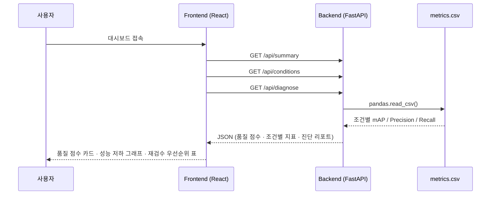
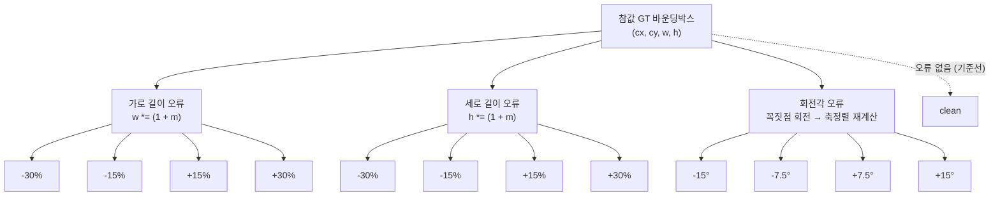

# AIDA — AI 데이터 품질 인증 플랫폼 (MVP 데모)

> 이 프로젝트가 처음이라면 [`docs/README.md`](docs/README.md)부터 읽을 것.
> 프로젝트 배경, 핵심 기술 원리(특허 연계), 아키텍처, 실험 설계, 의사결정 이유가
> 전부 문서화되어 있다. 개발 이력은 [`CHANGELOG.md`](CHANGELOG.md), 새 세션에서
> 이어받을 때는 [`docs/09-getting-started.md`](docs/09-getting-started.md) 참고.

## 이게 뭔가

**AIDA (AI Data Assurance)** — 객체탐지 AI 학습데이터의 바운딩박스 라벨 오류를
자동 진단하고 품질을 인증하는 B2B 데이터 품질검증 플랫폼.

객체탐지 모델은 사람이 그린 바운딩박스 라벨을 정답으로 학습한다. 그런데 라벨에
가로/세로 크기나 회전각 오류가 섞여 있으면 모델 성능이 떨어지는데, 지금까지는
"모델이 나쁜 건지 라벨이 나쁜 건지"를 객관적으로 구분할 방법이 없었다. AIDA는
국방과학연구소 특허(「가상 이미지 데이터 기반의 학습 데이터 검증 장치 및 방법」,
등록번호 10-2664201)의 방법론을 민간 데이터 품질검증에 적용해, **오류 유형별
성능 저하 패턴을 미리 구축해두고 실제 고객 데이터의 성능을 그 패턴과 비교**함으로써
어떤 유형의 라벨 오류가 있을 가능성이 높은지 역으로 진단한다. 자세한 원리는
[docs/01-technology.md](docs/01-technology.md).

## 시스템 구성

```
aida-project/
├── experiment/   KITTI 다운로드 → 전처리 → 오류 라벨 생성 → YOLOv8n 학습·평가
├── backend/      FastAPI — 실험 결과(CSV)를 읽어 품질 점수·진단 API 제공
├── frontend/     React + TypeScript (Vite) — 대시보드 UI
├── docs/         프로젝트 문서 (기술 원리·아키텍처·실험 설계·API 레퍼런스 등)
└── CHANGELOG.md  개발 변경 이력
```

### 전체 데이터 흐름

`experiment/`가 만들어낸 실험 결과(`metrics.csv`)를 `backend/`가 그대로 읽어
API로 제공하고, `frontend/`가 이를 시각화한다. 세 계층은 CSV 파일 하나로만
연결되어 있어서, 실제 실험 결과가 나와도 코드 수정 없이 파일 교체만으로 대시보드에
반영된다.


### API 요청 흐름



### 오류 조건 매트릭스 (13개)

`error_injector.py`가 참값(GT) 바운딩박스에 아래 13가지 조건 중 하나를 각각
적용해 조건별 학습 데이터를 만든다. 라벨 전체 중 30%에만 오류를 주입하고 나머지는
원본을 유지한다 (`config.ERROR_RATIO`). 자세한 배경은
[docs/03-experiment-design.md](docs/03-experiment-design.md).



실행 순서는 시간 리스크 관리를 위해 **핵심 7개(clean, width±30, height±30,
rot±15) 우선 → 세분화 6개(width±15, height±15, rot±7.5) 이어서**로 고정되어 있다
(`config.PRIORITY_1_NAMES` / `PRIORITY_2_NAMES`).

## 기술 스택

| 계층 | 기술 |
|---|---|
| 실험 파이프라인 | Python 3.14, Ultralytics YOLOv8n, PyTorch(MPS), OpenCV, NumPy, Pandas |
| 백엔드 | FastAPI, Pandas, python-dotenv |
| 프론트엔드 | React + TypeScript (Vite), recharts, axios |
| 데이터 | KITTI Object Detection 2D (Car 클래스) |
| 환경 관리 | venv + requirements.txt, `.env`/`.env.example` (서브프로젝트별) |

## 실행 방법

### 1. 백엔드

```bash
cd backend
cp .env.example .env        # 최초 1회만 (이미 있으면 스킵)
source venv/bin/activate    # 이미 venv 생성·설치되어 있음
uvicorn app.main:app --reload --port 8000
```

http://localhost:8000/docs 에서 API 확인 가능.

### 2. 프론트엔드 (새 터미널)

```bash
cd frontend
cp .env.example .env        # 최초 1회만 (이미 있으면 스킵)
npm run dev
```

http://localhost:5173 에서 대시보드 확인.

### 3. 실험 파이프라인 (선택, 새 터미널)

```bash
cd experiment
cp .env.example .env         # 최초 1회만
source venv/bin/activate     # 이미 venv 생성·설치되어 있음
python run_all.py --priority 1     # 핵심 7개 조건 (clean, width±30, height±30, rot±15)
python run_all.py --priority 2     # 시간 남으면 세분화 6개 이어서
```

완료되면 `backend/app/data/metrics.csv`가 실제 결과로 자동 갱신된다(수동 교체 불필요).
개별 단계만 실행하려면 `download_kitti.py` → `data_loader.py` → `error_injector.py` →
`train.py` → `evaluate.py` 순서로 각각 실행하면 된다.

## 테스트

```bash
# 백엔드 (API 엔드포인트, 진단 로직 — 고정된 테스트용 CSV로 결정론적 검증)
cd backend && source venv/bin/activate && python -m pytest tests/ -v

# 실험 파이프라인 (오류 라벨 변형 로직 — GPU/학습 불필요, 순수 함수 단위 테스트)
cd experiment && source venv/bin/activate && python -m pytest tests/ -v
```

## 환경변수

모든 설정값(포트, CORS origin, API base URL, 실험 하이퍼파라미터·시드·다운로드
URL 등)은 코드에 하드코딩하지 않고 `.env` 파일로 관리한다. 각 서브프로젝트에
`.env.example`이 있으니 최초 1회 `.env`로 복사해서 쓰면 된다. `.env`는
`.gitignore`에 포함되어 커밋되지 않는다.

**`backend/.env`**

| 변수 | 기본값 | 설명 |
|---|---|---|
| `HOST` | `0.0.0.0` | uvicorn 바인딩 호스트 |
| `PORT` | `8000` | uvicorn 포트 |
| `CORS_ORIGINS` | `http://localhost:5173` | 콤마로 구분된 허용 origin 목록 |
| `METRICS_CSV_PATH` | `app/data/metrics.csv` | 실험 결과 CSV 경로 (선택, 보통 그대로 둠) |

**`frontend/.env`**

| 변수 | 기본값 | 설명 |
|---|---|---|
| `VITE_API_BASE_URL` | `http://localhost:8000` | 백엔드 API base URL |

**`experiment/.env`**

| 변수 | 기본값 | 설명 |
|---|---|---|
| `AIDA_SEED` | `42` | 분할·오류 주입에 쓰이는 고정 시드 |
| `AIDA_TARGET_CLASS` | `Car` | 추출 대상 KITTI 클래스 |
| `AIDA_N_TRAIN` / `AIDA_N_VAL` | `400` / `120` | 학습/평가셋 이미지 수 (스모크 테스트 시 16/8 등으로 축소) |
| `AIDA_ERROR_RATIO` | `0.3` | 라벨 중 오류를 주입할 비율 |
| `AIDA_EPOCHS` | `50` | YOLOv8n 학습 에폭 수 |
| `AIDA_BATCH_SIZE` | `16` | 배치 크기 |
| `AIDA_IMG_SIZE` | `640` | 입력 이미지 크기 |
| `AIDA_DEVICE` | `mps` | 학습 디바이스 (M1 Mac 기준, 미지원 시 자동 cpu 폴백) |
| `AIDA_KITTI_LABEL_URL` / `AIDA_KITTI_IMAGE_URL` | KITTI S3 URL | 원본 다운로드 경로 |

## 실제 실험 결과 반영하기

지금은 `backend/app/data/metrics.csv`가 **목업(mock) 데이터**다. `experiment/`
파이프라인(위 "실행 방법" 3번)이 끝나면 같은 컬럼 구조
(`condition,type,magnitude,map50,map50_95,precision,recall`)로 이 파일이 자동
갱신되어 대시보드에 실제 결과가 그대로 반영된다. 코드 수정 불필요.

## API 엔드포인트

| 메서드 | 경로 | 설명 |
|---|---|---|
| GET | `/api/health` | 서버 상태 확인 |
| GET | `/api/summary` | 데이터셋 전체 요약 (품질 점수, 총 이미지/객체 수) |
| GET | `/api/conditions` | 실험 조건별 성능 지표 (mAP, Precision, Recall) |
| GET | `/api/diagnose` | 오류 유형별 진단 리포트 (재검수 우선순위 포함) |

자세한 응답 스키마는 [docs/04-api-reference.md](docs/04-api-reference.md).

## 팀

| 이름 | 역할 | 소속 |
|---|---|---|
| 박성원 | 대표 / 기술개발 (백엔드·인프라) | 수원대학교 정보보호학과 |
| 김해연 | 기술개발 (AI/객체탐지) | 영남대학교 전자공학과 |
| 서정호 | 플랫폼개발 | 대구가톨릭대학교 반도체전자공학과 |
| 정경준 | 플랫폼개발 (프론트엔드) | 고려대학교 기계공학부 |
