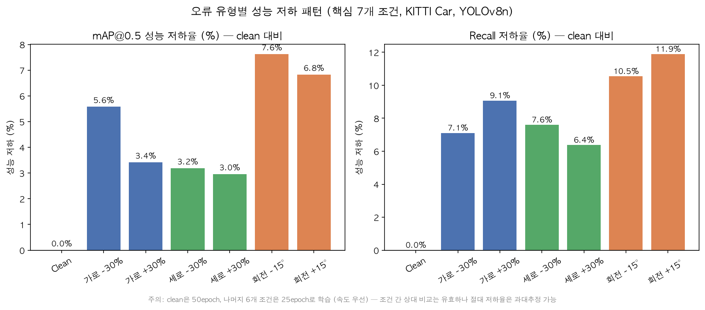

# 10. 실험 결과 — 핵심 7개 조건 (2026-07-08)

`experiment/` 파이프라인으로 KITTI Car 클래스 400장(학습)+120장(평가), YOLOv8n
파인튜닝을 실제로 돌려서 나온 **첫 실측 결과**. 실험 설계는
[03-experiment-design.md](./03-experiment-design.md), 코드는 [`experiment/`](../experiment)
참고. 이 결과는 `backend/app/data/metrics.csv`에 반영되어 대시보드에도 그대로 보인다.

## 실행 조건 요약

| 항목 | 값 |
|---|---|
| 데이터 | KITTI Car 클래스, 학습 400장 / 평가 120장 (시드 42로 고정 분할) |
| 모델 | YOLOv8n, COCO 사전학습 가중치에서 파인튜닝 (자율주행 특화 가중치 아님) |
| 오류 주입 비율 | 라벨 30%에만 적용 (`ERROR_RATIO=0.3`), 나머지 70%는 원본 유지 |
| 학습 환경 | M1 Mac, MPS |
| **epoch** | **clean: 50epoch / 나머지 6개 조건: 25epoch** — 아래 "한계" 참고 |

## 결과표 (실측, clean 대비 성능 저하율)

| 조건 | 유형 | 강도 | mAP@0.5 | mAP@0.5:0.95 | Precision | Recall | mAP@0.5 저하율 |
|---|---|---|---|---|---|---|---|
| clean | 기준선 | 0% | 0.879 | 0.624 | 0.847 | 0.816 | 0.0% |
| width_m30 | 가로 | -30% | 0.830 | 0.554 | 0.842 | 0.758 | 5.6% |
| width_p30 | 가로 | +30% | 0.849 | 0.553 | 0.880 | 0.742 | 3.4% |
| height_m30 | 세로 | -30% | 0.851 | 0.566 | 0.845 | 0.754 | 3.2% |
| height_p30 | 세로 | +30% | 0.853 | 0.580 | 0.827 | 0.764 | 3.0% |
| rot_m15 | 회전각 | -15° | 0.812 | 0.534 | 0.848 | 0.730 | **7.6%** |
| rot_p15 | 회전각 | +15° | 0.819 | 0.547 | 0.855 | 0.719 | **6.8%** |

나머지 6개 세분화 조건(width/height ±15%, rot ±7.5°)은 아직 목업 데이터다
(`docs/09-getting-started.md`의 "아직 안 된 것" 1번 — `run_all.py --priority 2`로
이어서 실행 예정).

## 핵심 발견 3가지

### 1. 세 오류 유형 모두 clean 대비 뚜렷한 성능 저하를 보인다 — 핵심 가설 지지

`03-experiment-design.md` 7절의 성공 기준("각 오류 유형이 정상 데이터 대비 구분되는
성능 패턴을 보임")을 일단 충족한다. 다만 아래 2), 3)에서 보듯 "구분되는 패턴"의
의미를 더 정교하게 다듬을 필요가 있다.

### 2. 회전각 오류가 가로/세로 오류보다 훨씬 크게, 그리고 양방향으로 비슷하게 성능을 떨어뜨린다

- mAP@0.5 저하: 회전(6.8~7.6%) > 가로(3.4~5.6%) ≈ 세로(3.0~3.2%)
- Recall 저하: 회전(10.5~11.9%) > 가로(7.1~9.1%) ≈ 세로(6.4~7.6%)
- **주목할 점**: 가로는 -30%(5.6%)와 +30%(3.4%)가 방향에 따라 차이가 나는 반면,
  회전은 -15°(7.6%)와 +15°(6.8%)가 서로 비슷하다. 이는 김성호 교수님이
  [11-professor-feedback.md](./11-professor-feedback.md) 2번에서 지적한 내용과
  정확히 들어맞는다 — **회전 방향(부호)과 무관하게 축정렬(axis-aligned) 재계산이
  박스를 항상 "키우는" 방향으로만 작용하기 때문에, +15°와 -15°가 서로 반대 효과가
  아니라 비슷한 효과를 낸다.** 즉 지금 구현은 "회전각 오류"라기보다 "박스를 필요
  이상으로 부풀리는 오류"에 가깝고, 그 부풀림이 단순 가로/세로 스케일보다 두 축을
  동시에 왜곡해서 더 강하게 성능을 깎는 것으로 보인다.
- **판단**: 교수님 지적이 실측 데이터로 확인됐다. 다만 완전히 틀린 신호는 아니고,
  "이 방식의 회전각 오류는 크기 오류보다 일관되게 더 해롭다"는 자체는 유의미한
  결과다. 발표에서는 "회전각 오류가 가장 치명적"이라는 결과는 그대로 쓰되, 왜
  가로/세로와 다른 패턴(방향 대칭성)을 보이는지는 교수님 피드백대로 한계로
  선제적으로 설명하는 편이 안전하다.

### 3. Precision은 거의 안 변하고 Recall만 뚜렷이 떨어진다 — mAP 외에 볼 지표(질문 3의 답)

7개 조건 모두 Precision은 -1~+1%p 안에서 거의 그대로거나 오히려 소폭 개선(예:
width_p30 -3.9%, rot_p15 -0.9%는 개선 방향)되는 반면, Recall은 전 조건에서 6.4~11.9%
하락한다. 즉 **라벨 오류는 "모델이 없는 걸 있다고 우기게(오탐)" 만들기보다 "있는
걸 놓치게(미탐)" 만드는 쪽으로 작용한다.** `03-experiment-design.md` 9절의 열린
질문 "mAP 외에 함께 봐야 할 지표"에 대한 실측 답: **Recall이 라벨 오류에 가장
민감한 지표**다. 진단 모듈(`/api/diagnose`)의 근거로 Recall 하락폭을 전면에
내세우는 게 좋겠다.

## 한계 (발표 전 반드시 인지하고 있어야 함)

1. **epoch 불일치 (가장 중요)** — 시간 단축을 위해 `clean`만 원래 계획대로
   50epoch, 나머지 6개는 25epoch로 줄여 실행했다(`docs/06-decisions.md` 참고 예정).
   `03-experiment-design.md`의 핵심 원칙("오류 조건이 달라져도 학습
   하이퍼파라미터는 전 조건에서 동일하게 고정")을 어겼다. **6개 오류 조건끼리는
   모두 25epoch로 공정하게 비교 가능**하지만, clean(50epoch) 대비 절대 저하율은
   과대추정됐을 가능성이 있다 — clean이 더 많이 학습돼 유리한 상태이기 때문. 조건
   간 상대 순위(회전 > 가로 ≈ 세로)는 신뢰할 수 있지만, "정확히 몇 % 저하"라는
   절대 수치는 참고용으로만 쓸 것.
   - **저비용 검증 방법**: `clean`을 25epoch로 한 번 더 돌려(`train.py --condition
     clean --epochs 25 --evaluate`, 약 15~20분) 같은 epoch 기준 저하율을 재계산하면
     이 한계를 없앨 수 있다. 시간 되면 실행 권장.
2. **반복 실험 없음** — 조건당 1회 실행(seed 42 고정)이라 위 수치가 순수한 "오류
   효과"인지 학습 과정의 노이즈(초기화, 배치 순서 등)인지 통계적으로 분리하지
   못한다. 심사위원이 물으면 "1차 예선/2차 예선 단계에서는 방향성 확인이
   목표였고, 본선까지 갈 경우 조건당 복수 시드 반복으로 통계적 유의성을 검증할
   계획"이라고 답하는 것을 권장.
3. **회전각 오류 구현의 기하학적 한계** — 위 "핵심 발견 2" 및
   [11-professor-feedback.md](./11-professor-feedback.md) 참고. 축정렬 재계산 방식은
   방향성(부호)을 사실상 지운다.
4. **세분화 6개 조건 미실행** — width/height ±15%, rot ±7.5°는 아직 목업 데이터.

## 다음 액션

- [ ] (선택, ~15~20분) `clean`을 25epoch로 재실행해 공정 비교 기준 확보
- [ ] 세분화 6개 조건 실행 (`run_all.py --priority 2`)
- [ ] 발표자료(PPT)에 위 그래프와 "핵심 발견 3가지" 반영, 한계는
      [11-professor-feedback.md](./11-professor-feedback.md)의 대응 방안대로 선제 설명
- [ ] `/api/diagnose`, 프론트엔드 문구를 "확정 진단" → "확률적 진단 + 재검수
      우선순위 가이드"로 톤 조정 (교수님 피드백 5번, 코드 변경 없이 문구만)
