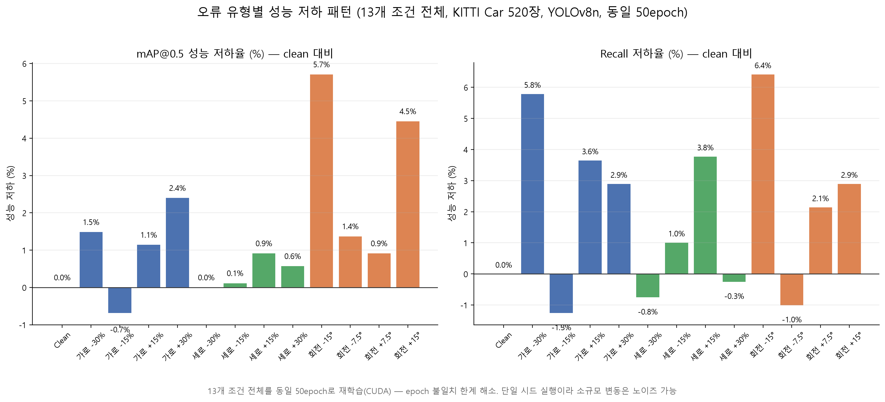

# 10. 실험 결과 — 13개 조건 전체 (2026-07-08, CUDA 재실행)
<!-- 시점 표시 -->

> 이 문서는 **13개 조건 시절(2026-07-08)** 의 실측 결과다. 그 뒤로 조건이 27개로 늘었고, 시드 7개로 오차막대를 붙였으며, 여러 결론이 뒤집혔다. **현재 수치는 [21-next-plan.md](./21-next-plan.md)를 볼 것** — 특히 여기 적힌 단일 시드 값들은 학습 실행 간 산포(±0.0185)를 고려하지 않은 것이다.

`experiment/` 파이프라인으로 KITTI Car 클래스 400장(학습)+120장(평가), YOLOv8n
파인튜닝을 **13개 조건 전체 동일 50epoch**로 재실행해서 나온 최종 실측 결과.
CUDA 데스크탑(RTX 3050)에서 실행했으며, 이전 M1 Mac 결과(핵심 7개, epoch
불일치 있었음)를 대체한다. 실험 설계는 [03-experiment-design.md](./03-experiment-design.md),
코드는 [`experiment/`](../experiment) 참고. 이 결과는 `backend/app/data/metrics.csv`에
반영되어 대시보드에도 그대로 보인다.

## 실행 조건 요약

| 항목 | 값 |
|---|---|
| 데이터 | KITTI Car 클래스, 학습 400장 / 평가 120장 (시드 42로 고정 분할) |
| 모델 | YOLOv8n, COCO 사전학습 가중치에서 파인튜닝 (자율주행 특화 가중치 아님) |
| 오류 주입 비율 | 라벨 30%에만 적용 (`ERROR_RATIO=0.3`), 나머지 70%는 원본 유지 |
| 학습 환경 | Windows, NVIDIA RTX 3050 (CUDA) |
| **epoch** | **13개 조건 전체 동일 50epoch** — 이전 M1 결과의 epoch 불일치 한계 해소 |

## 결과표 (실측, clean 대비 성능 저하율)

| 조건 | 유형 | 강도 | mAP@0.5 | mAP@0.5:0.95 | Precision | Recall | mAP50 저하율 | Recall 저하율 |
|---|---|---|---|---|---|---|---|---|
| clean | 기준선 | 0% | 0.876 | 0.626 | 0.859 | 0.795 | 0.0% | 0.0% |
| width_m30 | 가로 | -30% | 0.863 | 0.584 | 0.882 | 0.749 | 1.5% | 5.8% |
| width_m15 | 가로 | -15% | 0.882 | 0.602 | 0.838 | 0.805 | -0.7% | -1.3% |
| width_p15 | 가로 | +15% | 0.866 | 0.590 | 0.865 | 0.766 | 1.1% | 3.6% |
| width_p30 | 가로 | +30% | 0.855 | 0.564 | 0.848 | 0.772 | 2.4% | 2.9% |
| height_m30 | 세로 | -30% | 0.876 | 0.587 | 0.872 | 0.801 | 0.0% | -0.8% |
| height_m15 | 세로 | -15% | 0.875 | 0.594 | 0.858 | 0.787 | 0.1% | 1.0% |
| height_p15 | 세로 | +15% | 0.868 | 0.597 | 0.884 | 0.765 | 0.9% | 3.8% |
| height_p30 | 세로 | +30% | 0.871 | 0.582 | 0.852 | 0.797 | 0.6% | -0.3% |
| rot_m15 | 회전각 | -15° | 0.826 | 0.554 | 0.840 | 0.744 | **5.7%** | **6.4%** |
| rot_m7_5 | 회전각 | -7.5° | 0.864 | 0.570 | 0.845 | 0.803 | 1.4% | -1.0% |
| rot_p7_5 | 회전각 | +7.5° | 0.868 | 0.579 | 0.851 | 0.778 | 0.9% | 2.1% |
| rot_p15 | 회전각 | +15° | 0.837 | 0.555 | 0.811 | 0.772 | 4.5% | 2.9% |

13개 조건 전체가 동일 조건(50epoch)으로 학습되어, 이전 결과의 "clean만 50epoch,
나머지 25epoch" 편향이 완전히 사라졌다. IoU 기반 오류강도 지표(`experiment/iou_table.csv`,
[11-professor-feedback.md](./11-professor-feedback.md) 3번 대응)도 이 데이터와 별개로
이미 계산돼 있다.

## 핵심 발견 4가지

### 1. 회전각 오류가 여전히 가장 크게 성능을 저하시킨다 — 핵심 가설 재확인

동일 50epoch 조건에서도 `rot_m15`(mAP50 -5.7%, Recall -6.4%)가 13개 조건 중
가장 큰 저하를 보인다. 가로/세로 오류의 최대 저하(width_p30 -2.4%, height_p15
-3.8%)보다 뚜렷하게 크다. `03-experiment-design.md` 7절의 성공 기준("오류
유형이 정상 대비 구분되는 성능 패턴을 보임")을 재확인.

### 2. 다만 "±15°가 완전히 대칭"이라는 이전 결과는 노이즈가 섞여 있었다

이전 M1 결과에서는 `rot_m15`(7.6%)와 `rot_p15`(6.8%)가 거의 같아 "방향과
무관하게 대칭적으로 나빠진다"고 해석했는데, 동일 epoch로 다시 돌리니
`rot_m15`(5.7%)와 `rot_p15`(4.5%)의 차이가 더 벌어졌다. IoU 기준으로는
-15°와 +15°가 수학적으로 완전히 동일하게 박스를 왜곡하므로(`iou_table.csv`,
둘 다 IoU 0.6309) **라벨 왜곡 자체는 대칭이지만, 실제 학습 결과의 미세한
차이는 단일 시드 실행의 노이즈**로 봐야 한다 — 어떤 30%가 무작위로 오류
처리됐는지, 학습 초기화 등이 조건마다 다르기 때문. [12-experiment-results.md
"한계" 절](#한계-발표-전-반드시-인지하고-있어야-함) 2번 참고. 그럼에도
"회전이 가로/세로보다 일관되게 더 해롭다"는 결론 자체는 두 번의 독립 실행
(M1, CUDA) 모두에서 동일하게 재현됐다.

### 3. Precision은 거의 안 변하고 Recall이 더 민감하게 반응한다 — 재확인

전 조건에서 Precision은 0.81~0.88 범위 안에서 크게 흔들리지 않는 반면,
Recall은 조건에 따라 -1.3%~+6.4%까지 폭넓게 변한다. `rot_m15`가 Recall
기준으로도 가장 크게(-6.4%) 나빠져 mAP 결과와 방향이 일치한다. 진단 모듈
(`/api/diagnose`)의 근거로 Recall 하락폭을 전면에 내세우는 기존 방침 유지.

### 4. 작은 강도(±15%, ±7.5°)에서는 성능 저하가 거의 없거나 오히려 개선처럼 보인다

`width_m15`(-0.7%), `height_m30`(0.0%), `rot_m7_5`(1.4%)처럼 작은 오류
강도에서는 저하가 미미하거나 음수(개선처럼 보임)로 나타난다. 이는 두 가지로
해석 가능하다: (1) 작은 오류는 실제로 YOLO 학습에 거의 영향을 주지 않을
만큼 관대할 수 있음, (2) 단일 시드·단일 실행이라 노이즈가 신호보다 커서
작은 효과가 묻힐 수 있음. 이 구간은 반복 실험(복수 시드) 없이는 "진짜 개선"과
"노이즈"를 구분할 수 없다 — 아래 "한계" 2번 참고.

## 한계 (발표 전 반드시 인지하고 있어야 함)

1. ~~epoch 불일치~~ — **해소됨.** 13개 조건 전체를 CUDA에서 동일 50epoch로
   재실행해, 이전 결과의 "clean만 유리했다" 편향이 사라졌다.
2. **반복 실험 없음** — 조건당 1회 실행(seed 42 고정)이라 위 수치가 순수한
   "오류 효과"인지 학습 과정의 노이즈(초기화, 배치 순서, 30% 무작위 선택 등)인지
   통계적으로 완전히 분리하지 못한다. 특히 "핵심 발견 2, 4"에서 다룬 작은
   강도·부호 비대칭은 이 노이즈의 영향일 가능성이 있다. 심사위원이 물으면
   "방향성 확인이 1·2차 예선 단계의 목표였고, 본선까지 갈 경우 조건당 복수
   시드 반복으로 통계적 유의성을 검증할 계획"이라고 답할 것.
3. **회전각 오류 구현의 기하학적 한계** — `error_injector.py`의 회전 변형은
   박스 4꼭짓점을 회전시킨 뒤 그 꼭짓점을 감싸는 axis-aligned 사각형으로
   재계산한다. IoU 기준으로는 -15°/+15°가 완전히 동일하게 박스를 왜곡시켜
   방향성이 사라진다(`iou_table.csv`). 김성호 교수님 피드백
   ([11-professor-feedback.md](./11-professor-feedback.md) 2번, ★ 가장 중요한
   지적) — 발표에서 선제적으로 인정하고 후속 계획(OBB 도입 또는 중심점이동·
   스케일 교체)으로 제시.
4. **세분화 조건도 단일 시드** — 13개 조건 모두 확보했지만 여전히 조건당
   1회 실행이라 위 2번 한계가 전체에 적용된다.

## 다음 액션

- [x] **13개 조건 전체를 CUDA 데스크탑에서 동일 50epoch로 재실행** — 완료.
      결과표·그래프·한계 절 갱신 완료 (이 문서)
- [x] 발표자료(PPT)에 결과 그래프·핵심 발견·완화된 진단 문구 반영 완료 —
      `../AIDA_발표자료_v2(결과반영).pptx`
- [x] `/api/diagnose`, 프론트엔드 실제 문구를 "확정 진단" → "확률적 진단 + 재검수
      우선순위 가이드"로 톤 조정 완료 (`ErrorReportTable.tsx`, `04-api-reference.md`)
- [x] 조건별 IoU 감소율 계산 완료 (`experiment/compute_iou_table.py` →
      `iou_table.csv`) — 교수님 피드백 3번 대응
- [ ] PPT에 회전각 한계 다이어그램·IoU 감소율 그래프 반영 (진행 중,
      [13-ppt-visuals-checklist.md](./13-ppt-visuals-checklist.md) 참고)
- [ ] 대시보드에 13개 조건 상세 표 + CSV 다운로드 추가
      ([14-dashboard-enhancement-plan.md](./14-dashboard-enhancement-plan.md) 참고)
