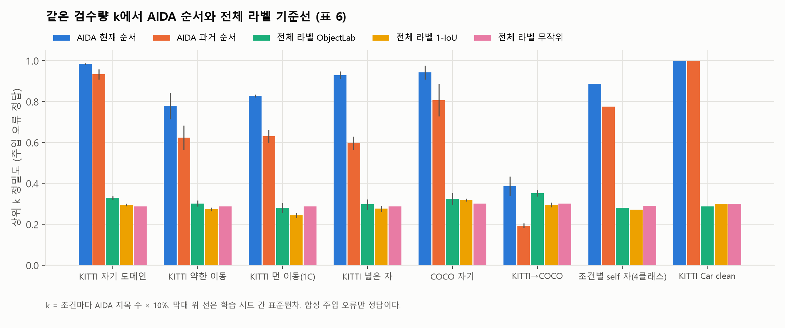
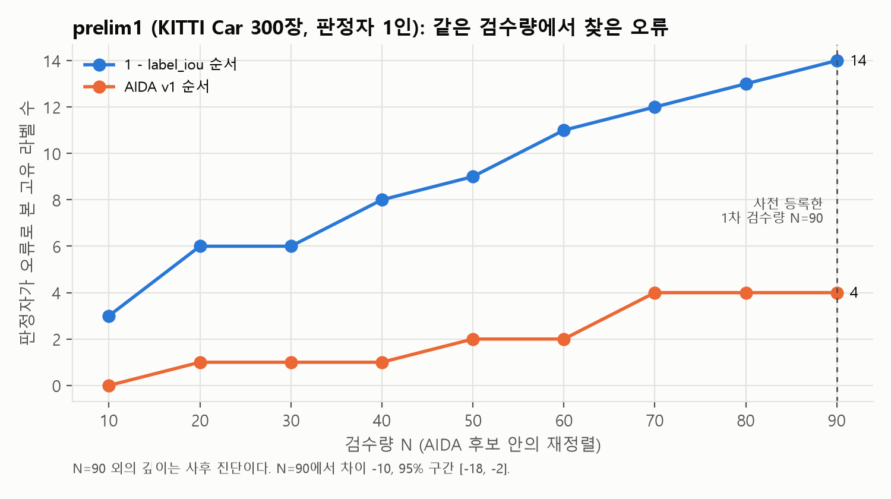
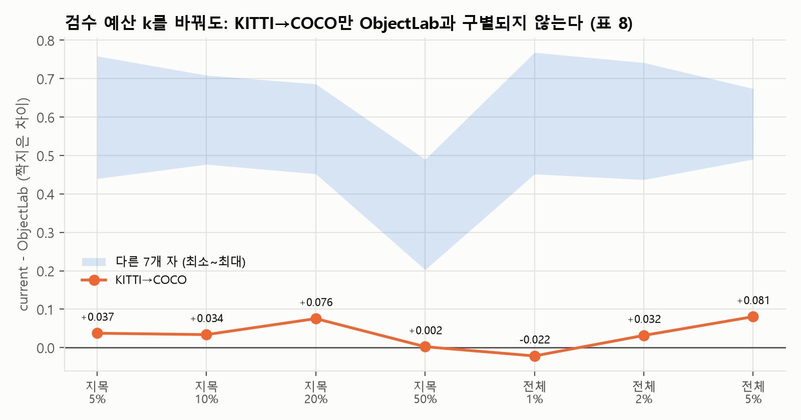

# AIDA 논문 초안 (한국어 긴 판, 2026-09-29)

> **읽는 법.** `【…】`는 빈칸이다 — Q-A 본 실험 결과, 사용자 결정, 미확인 서지. 투고처는 국내 학술지(KCI 등재지)로 정했다(2026-09-29) —
> 긴 판을 그대로 쓰고, 이전의 "3쪽판" 표시는 지웠다. 인용은 `[n]`이고 목록은 [`references.md`](references.md), 수치의
> 근거 파일은 [`claims_to_evidence.md`](claims_to_evidence.md), 결정 필요 항목은 [`open_items.md`](open_items.md).
> **Q-A(8절) 결과는 실행 전이라 어떤 수치도 없고 방향도 예측하지 않는다.** 사업 표현(인증·품질점수·ROI·시장)은 쓰지 않았다.

## 제목 후보

1. **같은 검수 예산에서 사람이 확인한 오류로 객체탐지 라벨 오류 순위를 견주는 평가 절차와 기준 모델 도메인 적합의 영향**
2. 객체탐지 라벨 오류 재검수 순위의 고정 예산 가림 판정 평가 — 풀링·기록 단위 부트스트랩·미판정 후보 처리
3. 기준 모델이 라벨 오류 진단을 좌우한다: 도메인 적합 효과의 정량화와 고정 예산 사람 판정 비교

## 요약

객체탐지 학습 데이터의 바운딩박스 라벨 오류를 찾아 **재검수 우선순위**를 매기는 방법은 여럿이지만, 검수자에게 중요한
것은 "같은 검수량에서 몇 건의 진짜 오류를 먼저 보게 하는가"다. 자연 발생 오류에는 참값이 없어 이 질문에는 사람 판정이
필요하다. 본 연구는 (1) 여러 순위 방법의 상위 N 합집합만 순위·점수를 가린 채 사람이 판정하고, 주행 기록 단위 짝지은
부트스트랩으로 차이의 구간을 내며, 분석 계획을 판정 전에 커밋하는 **고정 예산 가림 판정 절차**를 설계했다. 이 구조는
정보검색의 풀링과 같고, 재표본마다 상위 N을 다시 고를 때 **미판정 후보가 끼어들어 0건으로 세어지는 문제**를 찾아 고정
재표본 합집합 전량 판정으로 해결했다(합성 자료 네 조건에서 두 처리 모두 95% 구간의 포함률이 0.94~1.00으로 명목값 근처였다 — 해법의 목적은 포함률 개선이 아니라
미판정 후보를 0건으로 세는 구조적 오류를 없애는 것이다; 4.3절). (2) 주입 오류 통제
실험(KITTI·COCO, 조건 26~29, 학습 시드 3~7)으로 **기준 모델("자")의 도메인 적합**이 진단 품질을 얼마나 좌우하는지 쟀다.
재검수 목록 상위 10% 정밀도는 과거 순서(`legacy_severity_v0`)에서 자기 도메인 자 94.0%(±2.2) 대 어긋난 자 61.3~65.8%,
현재 제품 순서(`review_order_v1`)에서 98.5%(±0.4) 대 76.2~90.7%였다(두 순서 모두 시드 7개 모두에서 자기 도메인 자가 최고).
현재 순서에서는 넓은 자(90.7%)가 자기 도메인 자에 가까워 하락 폭이 순서에 따라 달랐다. KITTI 자를 COCO에 쓰면 두 순서 모두
크게 떨어졌고(COCO 자기 82.4%·92.1% → 26.0%·39.1%), 과거 순서의 유형별 값에서는 누락만 비교적 살아남았다(94.9%→76.7%). 같은 검수량의
전체 라벨 기준선(무작위·1−IoU·ObjectLab 적응)은 기존 라벨 층에서 24~35%였다(1−IoU는 동점 씨앗에 따라 21~37%). 같은 k에서 현재
순서는 KITTI 안 자 4종과 COCO 자기 자에서 모든 시드에서 세 기준선보다 높았지만, KITTI→COCO에서는 ObjectLab 적응과 구별되지
않았다(차이 +0.034, 탐색적 구간 [−0.046, +0.114]). 이 비교의 정답은 주입한 오류뿐이다. (3) 절차의
동기 사례로, 국방과학연구소 특허의 역진단 원리에서 출발한 규칙 — 데이터셋 단위 오류 유형 판정으로 후보를 통째로 승격하는
순서(v1) — 를 개발자 1인이 가림 판정한 탐색 비교(KITTI Car 300장, AIDA 후보 안의 재정렬)에서, v1은 N=90에서 고유 오류 4건,
단순 IoU 불일치 순서는 14건이었다(차이 −10, 95% 구간 [−18, −2]). 절차를 nuImages val에 처음 적용한 사전 등록 비교(후보 생성
포함, ObjectLab 박스 단위 점수 적응 기준선 포함, 보조 표본 30% 이중 판정)의 결과는 【Q-A 결과 — 미실행】이다.

## 1. 서론

객체탐지 모델은 사람이 그린 바운딩박스를 참값으로 학습한다. 라벨의 크기·위치 오류, 누락, 중복, 클래스 오기입은 성능을
떨어뜨린다 — 박스 노이즈만으로도 COCO AP가 37.9에서 40% 노이즈에서 10.3으로[32], KITTI Car AP가 0.629에서 박스
노이즈 50%에서 0.502로 떨어졌고[33], 4유형 혼합 오류 20%에서 mAP50이 최대 3.9%p 떨어진 보고가 있다[2].
벤치마크 평가셋에도 라벨 오류가 만연하다[1]. 그러나 모델 성능만으로는 "모델의 문제"와 "라벨의 문제"를
가르기 어렵다.

국방과학연구소 특허 「가상 이미지 데이터 기반의 학습 데이터 검증 장치 및 방법」[4]은 참값 박스에 통제된 오류를 넣어
"오류 유형별 성능 저하 패턴"을 쌓고, 검증 대상 데이터의 성능을 그 패턴과 견줘 어떤 오류가 있는지 **역진단**하는 원리를
제시한다. 본 연구는 이 원리를 **동기이자 출발점**으로 삼았다. 실사 공개 데이터(KITTI, COCO, nuImages)에서 특허의
가상(합성) 이미지 생성 단계는 구현하지 않았고 원본 라벨을 참값으로 두고 오류를 주입했으며, 구현 과정에서 "성능 벡터 대조"는
판별력이 부족해 **기준 모델("자")의 예측과 라벨을 박스 단위로 대조하는 방식**으로 대체됐다(3.2절). 따라서 본 연구는 특허
방법을 검증하지 않으며, 특허 원리에서 출발한 규칙 — **자와의 대조로 얻은 데이터셋 단위 오류 유형 판정을 박스 단위 후보 순위에
곱하는 구조**(AIDA v1) — 은 4절 절차의 필요를 보여 주는 사례로만 다룬다(7절).

이 구조를 검증하려다 지표가 문제라는 것을 알게 됐다. 라벨 오류 검출 연구는 대개 주입 오류의 AUROC나 AP를 보고하지만
[2][3][5][10], 검수자가 실제로 겪는 것은 "검수 예산 N건 안에서 진짜 오류를 몇 건 보는가"이고, 자연 발생 오류에는 참값이
없어 사람이 판정해야 한다. 그래서 **여러 방법의 상위 N 합집합만 판정**하고, 순위·점수·출처를 가린 채 섞어 판정하며, 주행
기록 단위로 짝지어 재표집하는 절차를 설계했다. 이 구조는 정보검색 평가의 풀링(pooling)과 불완전 판정 문제[6][7][8]와 같고, 예산 아래 교정 수를
최대화하는 라벨 정제[35]와 목표를 공유한다. 재표본마다 상위 N을 다시 고를 때 **미판정 후보가 상위 N에 들어와 수확 0으로 세어지는 문제**를 코드에서 확인하고 "고정 재표본
합집합 전량 판정"으로 해결했다. 이 절차가 본 논문의 중심이다.

기여는 셋이다.

1. **고정 예산 가림 판정 절차.** 예산 기반 라벨 정제[35]와 풀링 평가[6][37]를 객체탐지 박스 라벨 검수에 적용하고, 기록
   단위 재표집에 따른 상위 N 재선정에서 생기는 미판정 문제를 **사전에 고정한 재표본들의 후보 합집합을 전량 사람이 판정**하는
   방식으로 처리하는 재현 가능한 평가 절차와 그 합성 검증(4.3절). 고정 예산·풀링·가림·군집 부트스트랩 각각은 기존 방법이며
   (2절), 이 결합 절차와 같은 선행연구는 조사 범위(2026-10-06)에서 찾지 못했다. 이 처리는 사용한 유한 재표본 집합의 판정
   누락을 없앨 뿐, 구간의 포함률을 보장하지 않는다.
2. **기준 모델 도메인 적합 효과의 정량화.** 같은 진단 규칙에서 자만 바꿔도 상위 10% 정밀도가 과거 순서에서 94%→61~66%,
   현재 순서에서 98.5%→76~91%(KITTI 안)로 떨어지고, KITTI→COCO에서는 두 순서 모두 26~39%였다. 현재 순서의 넓은 자처럼 하락이
   작은 경우도 있고, 오류 유형마다 무너지는 정도가 다르다(6절). 자기 정제(의심 프레임 제거 후 재학습)는 13개 설정
   전부에서 원본보다 나빴다.
3. **사례 연구: 한 규칙의 실패.** 데이터셋 단위 유형 판정으로 후보를 통째로 승격하는 규칙(v1)은 개발자 1인의 탐색 비교(AIDA
   후보 안의 재정렬)에서 단순 IoU 불일치 순서보다 나빴고, 실패 원인을 상대 문턱 승격 규칙까지 추적했다(7절). 이 사례가 절차의
   필요를 보여 준다 — 주입 오류에서는 같은 자·같은 비교에서 결과가 반대였다(KITTI Car clean 자에서 v1 순서 0.996 대 AIDA
   후보 안 IoU 재정렬 0.635, 표 6).

## 2. 관련 연구

**객체탐지 라벨 오류 검출.** ObjectLab[5]은 예측과 라벨을 대조해 위치 오류(badloc)·클래스 오류(swap)·누락
(overlooked)의 박스 점수를 만들고 이미지 단위 점수로 합쳐 이미지를 순위화하며, 평가는 이미지 단위 AP·Precision@100
등이다. Schubert 등[2]은 손실 값으로 박스 단위 오류(drop/flip/shift/spawn)를 순위화하고, 실데이터에서는 자기
방법의 상위 200건만 사람이 판정해 정밀도를 보고했다. CLOD[3]는 군집과 confident learning으로 박스 단위 오류를
찾고 AUROC로 평가한다. Penquitt 등[9]은 ObjectLab의 박스 단위 점수(overlooked는 예측에, 1−badloc은 참값 박스에)를
따로 써서 "발견한 누락 수 대 주석 시간" 곡선으로 방법을 견줬다. 같은 그룹의 후속 연구[10]는 KITTI·COCO·
Cityscapes·VOC에서 크라우드 검증한 자연 오류를 정답으로 두고 손실 검사·ObjectLab·MetaDetect·기준선을 AP와 P/R/F1로
비교하며, 라벨 오류 검출을 "우선순위 문제"로 자리매김한다. 이들 중 **여러 방법을 같은 검수 예산 N에서 상위 N 합집합만 사람이
가림 판정해 확인한 오류 수로 직접 비교한 것은 없다** — ObjectLab의 P@100은 이미지 단위이고, Penquitt 등[9]은 k 대신
시간축이며, [10]은 사전에 완전 검증한 정답에 기반한다. 본 연구와 [10]의 차이는 정답의 출처(사전 완전 검증 대
풀링된 판정)와 구간 추정(기록 단위 부트스트랩)이다. 자연 오류 정답을 검출 방법의 제안을 사람이 검토해 모으는 경우[43]에는
정답이 그 방법들의 제안에 묶인다. 본 연구도 비교한 방법들의 상위 N만 판정하므로, 그 목록 안의 비교는 가능하지만 데이터
전체의 오류율이나 다른 방법의 재평가로 넓힐 수 없다(10절). 분야 개관과
오류 분류는 [47]을 따른다.

**라벨 오류 평가 지표.** Confident learning[11]과 그 벤치마크 감사[1]는 후보를 순위로 뽑아 사람이
검증하고 "플래그 중 확인된 비율"을 보고하며, 제한된 검토 예산에서의 우선순위 부여를 권고한다. Klie 등[12]은 주석 오류
검출 방법을 flagger(P/R/F1)와 scorer(AP, Precision@k%)로 나누고, 점수 상위 k%를 수동 교정하는 시나리오로 Precision@k%·Recall@k%를 정의한다.
본 연구의 1차 지표(N=90에서 고유 오류 수)는 scorer 평가를 박스 단위·사람 판정으로 옮긴 것이다.

**예산 아래의 라벨 정제.** Bernhardt 등[35]은 총 재라벨링 예산 아래 교정되는 표본 수를 최대화하는 능동 라벨 정제를
제안했고(분류 과제), Schubert 등[36]은 객체탐지에서 새 주석과 오류 제안 검토를 같은 비용 단위로 두고 같은 예산에서
비교했다(지표는 학습 성능). "같은 검수 예산에서 무엇을 먼저 볼까"라는 목표는 이렇게 이미 있다. 본 연구는 학습 성능이 아니라
**사람이 확인한 고유 오류 수의 방법 간 차이**를 1차 지표로 삼는다.

**정보검색의 풀링과 불완전 판정.** TREC는 참가 시스템의 상위 k 문서 합집합(풀)만 판정한다[6]. Zobel[7]은 풀
깊이와 판정 불완전성이 시스템 순위에 미치는 영향을, Buckley와 Voorhees[8]는 표준 지표가 미판정 문서를 비관련으로
취급해 생기는 불안정과 대안(bpref)을 보였고, Sakai[13]는 미판정 문서를 목록에서 제거하는 condensed list를, Yilmaz와
Aslam[14]은 판정이 풀의 무작위 표본이라는 가정 아래 AP를 추정하는 infAP를 제안했다. Lipani 등[37]은 각 시스템 상위 K의
합집합(Depth@K)이 전체 판정량을 고정하지 못한다는 점을 들어 전체 풀 크기를 고정하는 전략들과 구분했다. 본 연구의 N도
**방법별 검수 예산**이고, 합집합 전체의 판정량은 따로 센다(4.1·4.3절). Sakai 등[38]은 같은 문서에 여러 독립 판정을 받아
풀을 무작위 순서로 판정할 때와 시스템 순위 순으로 판정할 때를 비교했다 — 본 연구가 순위·출처를 가리고 섞는 근거다.
Fröbe 등[39]은 미판정 문서의 라벨을 사전분포에서 뽑아 부트스트랩으로 점수 분포를 추정했고, Abbasiantaeb 등[40]은 사람
판정의 빈칸만 LLM 판정으로 채우면 모델에 따라 시스템 비교가 한쪽으로 기운다고 보고했다. 본 연구의 "재표본 상위 N에 미판정
후보가 진입해 0으로 세어지는" 문제는 미판정=비관련 취급의 부트스트랩판이며, 이를 **추정이나 AI 대치가 아니라 추가 사람
판정으로** 없앤다(4.3절).

**군집 부트스트랩과 사전 등록.** 이미지·주행 기록처럼 관측이 묶여 있으면 묶음 단위로 재표집해야 한다[15][16];
Sakai[17]는 토픽 단위 짝지은 부트스트랩으로 평가 지표를 견줬다. 군집 수가 적거나 크기가 고르지 않으면 군집 재표집의
추론이 부정확해질 수 있고 부트스트랩 분포를 점검해야 한다[42]. 평균 차이의 검정에는 t 검정이 실증적으로 무난했다[41]. 분석 계획을 자료를 보기 전에 고정하는 사전
등록[18]은 결과를 본 뒤 기준을 고르는 일을 막는다.

**비전 언어 모델 판정의 한계.** 본 연구는 AI 보조 판정자를 두지만 사람 판정의 대체로 쓰지 않는다. 최전선 VLM은 박스
위치 2지선다에서 사람에 크게 못 미치고[19], 가까이 붙은 도형의 겹침·접촉 판정이 약하며[20], 가림을 과소
보고한다[21]. 그림에 표시를 그려 넣으면 접지가 좋아진다[22]. 2025~2026년에는 VLM을 분류 라벨 QA에 쓴 사례[46]와, 가려진 객체의
amodal 박스에서 사람끼리도 위치가 다르고 범용 VLM은 그 사람 간 범위에 못 미친다는 보고[45]가 있다. 두 사람 이상의
독립 주석이 있어야 주석 변이를 잴 수 있다는 지적[44]도 본 연구의 이중 판정 설계(D8-2) 근거다. 따라서 AI 판정은 그림 표시 입력의 보조 표본으로만 쓰고,
사람–AI 일치도를 사람–사람 신뢰도나 정확도로 읽지 않는다.

## 3. 방법 — 역진단 파이프라인과 순위

### 3.1 오류 조건 매트릭스와 자

KITTI 2D[23] Car 클래스 400장(학습)·120장(평가)을 씨앗으로 고정 분할하고, 학습 라벨의 30%에 한 유형의 오류를 주입해
조건별 학습셋을 만든다. 유형은 가로·세로·스케일(±15%, ±30%), 중심 이동(±15%), 회전(±7.5°, ±15°; 축정렬 외접 상자로
근사), 누락·중복(10/20/30%), 다중 클래스에서 클래스 오기입(10/20/30%)이며 혼합 조건을 더해 26~29개다. 조건마다 YOLOv8n
[24]을 COCO 사전학습 가중치에서 동일 하이퍼파라미터(50에폭, 640px, 배치 16)로 미세조정하고 공통 평가셋으로 mAP·정밀도·
재현율을 잰다. 이 조건별 지표 표는 세 곳에 쓰인다 — (i) `clean` 조건의 모델이 곧 자가 된다, (ii) 주입 정답이 있는 조건
집합이 유형 판별·박스 정밀도·자 적합 실험(6절)의 평가 자료가 된다, (iii) 초기 구현의 "성능 벡터 대조"(정밀도·재현율을
조건표와 견주기)에 썼으나 이 대조는 판별력이 부족해 대체됐다(3.2절). 즉 특허 원리의 "성능 저하 패턴"은 이 연구에서
진단 근거가 아니라 **평가 자료와 자의 출처**로 쓰인다.

회전 조건은 축정렬 상자 표현의 한계로 크기 오류와 기하학적으로 구분되지 않는다(가로로 긴 상자를 15° 돌리면 세로가 약
48% 커진다). 회전 상자(OBB) 모델로 같은 조건을 다시 재면 회전 오류의 성능 저하가 사라졌다(3시드; 부록 A). 이후 분석에서
회전 조건은 "크기 계열"로 취급한다.

**자(ruler).** 깨끗한 라벨로 학습한 기준 모델의 예측을 자로 삼아 검증 대상 라벨을 잰다. 이 논문에 나오는 자는 다음과
같다(전부 YOLOv8n; 에폭은 `config.EPOCHS` 기본값 50이며 nuImages 자만 100에폭 — 2026-09-29 데스크탑에서 `runs*/…/args.yaml`
321개를 확인했다: `car_v1_e100` 하나만 100, 나머지 320개 전부 50).

| 이름 | 학습 데이터 | 클래스 | 학습 장수 | 쓰인 곳 |
|---|---|---|---|---|
| 자기 도메인 | KITTI, 평가 조건과 같은 프레임 풀(`mc`) | 4 (Car·Van·Pedestrian·Cyclist) | 400 | 6.2, 6.4, 6.5 |
| 약한 이동 | KITTI, 다른 프레임(`mc` 대 `cyclist_rich`) | 4 | 400 | 6.2, 6.4, 6.5 |
| 먼 이동 | KITTI Car 단일 클래스 | 1 | 400 | 6.2, 6.4, 6.5 |
| 넓은 자(800) | KITTI, 평가셋과 겹치지 않는 넓은 풀 | 4 | 800 | 6.2, 6.4, 6.5 |
| broad 자전거0 / 중 / 多 | KITTI 넓은 풀(평가셋과 겹침 0), Cyclist 인스턴스 0 / 39 / 76개 | 4 | 400 | (본문 수치 없음) |
| 조건별 self 자 | KITTI, 조건마다 그 조건의 학습셋으로 학습한 모델(`runs_mc/<조건>`) | 4 | 400 | 6.5 |
| KITTI Car(`clean`) | KITTI Car | 1 | 400 | 6.1, 6.3(KITTI→COCO), 6.5, prelim1 |
| COCO 자기 | COCO 차량 프레임 | 1 | 400 | 6.3, 6.5 |
| nuImages `car_v1_e100` | nuImages train(기록 단위 분할) | 1 (Car) | 3,200 | Q-A |

6.2의 어긋난 자 3종(약한 이동·먼 이동·넓은 자)은 6.4·6.5에도 같은 자를 쓴다. broad 자전거0/중/多는 이전 판본의 정렬 비교에만
쓰였고 본문 수치에는 없다.

### 3.2 박스 단위 진단

자의 예측과 라벨을 IoU≥0.4로 짝짓고, 짝의 크기·중심 차이(문턱 12%·10%), 중복(짝지어진 예측과 IoU≥0.5인 여분 라벨),
누락(확신도≥0.70이고 기존 라벨에 70% 이상 삼켜지지 않은 미매칭 예측), 클래스 불일치(확신도≥0.60)를 후보로 만든다.
후보의 심각도는 유형 신뢰도 × 신호 세기(× 기하 유형은 확신도 항)이며, 유형 신뢰도는 그 유형이 데이터셋에 "계통적으로
존재"(지목 비율 ≥12%, 또는 상대 문턱 — 0.06 이상이고 유형 중앙값의 2배)하는지에 따라 두 값 중 하나를 쓴다. **이 문턱과
상수는 같은 조건 집합에서 보정했다**(6절 한계).

데이터셋 단위 요약은 유형별 지목 비율과 계통 유형 판정이다. 특허 원리의 "성능 벡터 대조"(정밀도·재현율 2차원을 조건표와
견주는 것)는 초기 구현에서 판별력이 부족해 박스 단위 기하 증거로 대체했다 — 즉 본 연구의 유형 추정은 성능 저하 패턴이
아니라 자와의 대조에서 나온다.

### 3.3 순위 버전

| 버전 | 기존 라벨 후보 순서 | 누락 후보 순서 |
|---|---|---|
| **v1** `aida_v1_systematic_boost` | 계통 유형으로 판정된 유형의 후보 **전부**를 먼저, 그 안에서 심각도 | 같음 |
| **v2** `aida_v2_candidate_iou` | `1 − label_iou`(자와 가장 많이 겹치는 예측과의 IoU) | 심각도 |

v1이 서론에서 말한 "자 대조 유형 판정을 후보 순위에 곱하는 구조"의 구현이다 — 데이터셋 단위 판정이 후보 순서를 바꾼다. v2는 prelim1 뒤 "데이터셋 진단과 후보 순위를
분리"하기로 한 결정의 시험 버전이며, 기존 라벨 층에서는 후보 생성(규칙 필터)만 AIDA 고유다.

### 3.4 비교 방법

| 층 | 방법 | 모집단 | 순서 |
|---|---|---|---|
| 기존 라벨 | `aida` | AIDA 규칙이 만든 후보 | 3.3의 버전 |
| 기존 라벨 | `all_label_iou` | **모든** 기존 라벨 | `1 − label_iou` |
| 기존 라벨 | `all_label_objectlab` | cleanlab[25]이 점수를 낸 기존 라벨 | `1 − min(badloc, swap)` |
| 누락 | `aida` / `unmatched_confidence` / `unmatched_objectlab` | AIDA 누락 후보 / 필터 전 미매칭 예측 / overlooked 점수가 있는 예측 | 심각도 / 확신도 / `1 − overlooked` |

`all_label_objectlab`은 **ObjectLab의 공식 산출물(이미지 단위 점수)이 아니라, cleanlab 2.9.0이 공개한 박스 단위 badloc·swap
점수를 라벨마다 min으로 합친 이 연구의 적응**이다. badloc은 같은 클래스 예측이 없거나 최대 확신도가 0.5 이하면 1.0(깨끗)을
주고, swap은 확신도 0.95 초과인 다른 클래스 예측이 있어야 1 미만이 되므로, Car 단일 클래스 평가에서는 사실상 `1 − badloc`이다.
`all_label_iou`는 예측이 없는 라벨을 맨 위에 두고 ObjectLab 적응은 맨 아래에 두므로, 둘을 한 표에 놓으면 "자가 못 본
라벨"의 몫이 드러난다. 이 적응이 ObjectLab에 유리하지도 불리하지도 않다는 보장은 없다.

## 4. 방법 — 고정 예산 가림 판정 절차

### 4.1 판정 대상과 가림

층마다 **각 방법의 상위 N 합집합**을 판정한다(겹치면 한 번). N은 방법별 검수 예산이고, 합집합 전체의 판정량은 방법 수와
겹침에 따라 달라지므로 따로 보고한다[37]. 후보 생성 효과를 재기 위해 AIDA 규칙 밖 라벨에서 **무작위
K건**을 더 판정한다(어느 방법의 상위 N도 바꾸지 않는다). 판정 화면은 순위·점수·유형·출처·표본 여부를 보내지 않고 고정
씨앗으로 섞은 목록만 보여 준다. 판정은 `hit`(고쳐야 한다)·`miss`(이대로 써도 된다)·`hold`(확인할 수 없다)이며, `hold`는
예산을 쓰되 분모에서 빠진다. 판정에 쓰는 파일(이미지·라벨·자 기록·진단·묶음)은 얼려 SHA-256을 남기고, 묶음 지문에
순위 버전·씨앗·필터·coverage 설정을 넣어 판정 뒤 바뀌면 판정이 붙지 않게 한다.

### 4.2 1차 지표와 구간

1차 지표는 검수량 N에서 **판정자가 오류로 본 고유 라벨 수**의 두 방법 차이다(한 오류를 두 후보가 가리키면 하나로 센다).
구간은 이미지 또는 주행 기록을 단위로 두 방법을 **같은 묶음 목록으로 함께** 재표집하는 짝지은 부트스트랩(백분위 95%[34])이다.
재표본마다 순위와 상위 N을 처음부터 다시 계산한다.

### 4.3 미판정 후보의 진입 문제와 해법

재표본에서 어떤 기록이 빠지거나 두 번 뽑히면 원래 순위 N 밖의 후보가 상위 N에 든다. 그 후보가 판정되지 않았으면 현재
집계는 예산에는 넣고 수확에서는 빼므로 **예산을 쓰고 0건**으로 센다 — 정보검색에서 미판정을 비관련으로 취급하는 것과 같은
편향[8]이다. 우리는 이 처리를 회귀 검사로 고정하고, 실제 규칙(동점 키, 세 방법, K)에 맞춘 합성 시뮬레이션에서
미판정 진입이 AIDA 쪽 재표본의 43~49%, ObjectLab 적응 쪽 46~50%, `all_label_iou` 쪽 14~33%에서 생기며(재표본당 상위
90 중 미판정 평균 각 1.6~3.9건, 2.9~3.8건, 0.3~0.8건; 씨앗 3개) 방법마다 비대칭임을 확인했다 — 합성 조건의 예시이지 실제
값이 아니다.

해법은 **고정 재표본 합집합 전량 판정**이다. 부트스트랩 씨앗·반복 수·동점 씨앗이 사전에 고정돼 있으면 어느 후보가 어느
재표본의 상위 N에 드는지는 판정 없이 순위만으로 미리 계산할 수 있다. 그 합집합을 판정 목록에 더하고(원래 상위 N·점
추정치는 그대로), 최종 분석은 어느 재표본의 상위 N에라도 미판정이 있으면 구간을 내지 않는다. 비교 예산 N과 연구용 총
판정량을 갈라 적는다. **비용은 판정량 증가다.** 합성 조건에서는 원래 판정 범위의 22~30%가 더 필요했고, nuImages train
연습 묶음(N=20, K=10, 반복 200)에서는 기본 풀 89건에 83건(93%)이 더해졌다 — 연습 자료의 **계획용 수치**이며 본 판정의
N=90·반복 2000에서의 값은 묶음을 얼린 뒤에만 안다. 이 해법은 고정 재표본의 판정 누락만 없앨 뿐 백분위 구간의 포함률을
보장하지 않는다(기록 수가 30개 안팎이면 "few clusters" 범위[16][42]). 기록 재표집은 학습 시드 변동을 추정하지 않는다 —
두 불확실성은 단위가 다르다.

**합성 검증 (표 5).** 참값이 있는 합성 생성 과정(4.3절 첫 문단과 같은 규칙)을 초모집단으로 두고 데이터셋을 조건마다 200번
새로 뽑아, 두 처리 — 미판정을 0건으로 세는 처리와 고정 재표본 합집합 전량 판정 — 의 95% 백분위 구간(기록 단위 짝지은
부트스트랩 2000회)이 추정 대상 θ(같은 크기 데이터셋에서 N=90 고유 오류 수 차이의 기댓값, 데이터셋 5,000개의 전량 판정
관측 차이 평균)를 포함하는 비율과 구간 중점의 치우침을 쟀다. 조건은 기본(기록 35개), Q-A 모양(기록 30개 × 10장), 오류 확률
× 0.5, × 1.5의 넷이다.

| 조건 | 비교 | θ | 미판정=0: 포함률 / 치우침 | 합집합 전량 판정: 포함률 / 치우침 | 두 구간이 다른 반복 |
|---|---|---|---|---|---|
| 기본 | iou − aida | −0.41 | 0.985 / −0.37 | 0.990 / −0.55 | 59% |
| 기본 | ObjectLab − aida | −7.53 | 0.970 / −0.36 | 0.980 / −0.15 | 75% |
| Q-A 모양 | iou − aida | −0.37 | 0.990 / +0.41 | 0.985 / +0.01 | 75% |
| Q-A 모양 | ObjectLab − aida | −6.95 | 0.960 / +0.28 | 0.970 / +0.36 | 80% |
| 오류 × 0.5 | iou − aida | −0.25 | 0.970 / −0.10 | 0.975 / −0.19 | 50% |
| 오류 × 0.5 | ObjectLab − aida | −3.79 | 0.940 / −0.47 | 0.950 / −0.41 | 58% |
| 오류 × 1.5 | iou − aida | −0.65 | 0.995 / +0.46 | 1.000 / +0.20 | 73% |
| 오류 × 1.5 | ObjectLab − aida | −11.23 | 0.980 / −0.30 | 0.965 / +0.18 | 88% |

포함률의 몬테카를로 표준오차는 0~0.017이다. 두 처리 모두 포함률이 0.94~1.00으로 명목 95% 근처였고, 두 처리의 포함률 차이는
0.015 이하, 구간 중점의 치우침은 ±0.6건 이내, 평균 구간 너비도 거의 같았다. 재표본의 50~88%에서 두 구간이 달랐지만 그 차이는
작았다. 따라서 **이 생성 과정들에서는 미판정=0 처리가 구간을 크게 흐리지 않았고, 고정 재표본 합집합 판정이 포함률을 눈에 띄게
높이지도 않았다.** 이 해법을 채택한 이유는 포함률 개선이 아니라, 판정하지 않은 후보를 오류 아님으로 세는 구조적 오류를
사전에 없애 결과가 생성 과정의 우연에 기대지 않게 하는 것이다. 이 결론은 합성 생성 과정 네 조건에 대한 것이며, 실제
nuImages 자료에서 미판정 진입의 크기는 묶음을 얼린 뒤 `coverage` 계산으로 다시 센다. 근거 파일:
`experiment/planning_evidence/sim_coverage_{base,qa_like,low_error,high_error}_2026-09-29.json`.

대안으로 판정된 풀 안에서만 순위를 매기는 condensed list[13](추정 대상이 "판정된 풀에서 고를 때"로 바뀐다),
원래 목록을 고정하고 기록만 재표집하는 방식(재선정 효과를 말할 수 없다), 무작위 K 표본의 오류율로 대치하는 방식
(infAP[14]의 가정과 유사하나 판정 집합이 순위 의존이라 가정 위배)을 검토했고 채택하지 않았다.

### 4.4 동점·범위·사전 등록

`1 − label_iou`는 예측이 없는 라벨에 모두 1.0을 주므로 동점 덩어리가 N보다 클 수 있다. 동점은 파일 이름순이 아니라
고정 씨앗의 해시(`sha256(tie_seed:후보 id)`)로 자르고, 후보 선정·판정 목록·내보내기·집계·부트스트랩이 같은 키를 쓴다.
원본 픽셀 높이 30px 미만 라벨은 기존 라벨 층의 비교 범위 밖에 둔다(자가 그 절반을 못 본다; 제외 수를 기록). N·K·씨앗·
1차 지표·구간 방법·Δ 방침을 판정 전에 커밋한다. Δ는 두지 않으며 성공·실패를 판정하지 않는다 — 판정자 1인의 비교는
사전 등록돼도 탐색적이다.

## 5. 실험 설정

| 실험 | 데이터 | 자 | 판정 | 상태 |
|---|---|---|---|---|
| 1. 통제 실험 | KITTI Car 1·4클래스, COCO 차량; 주입 오류 26~29조건; 학습 시드 1~7(표 6의 마지막 두 행은 1개) | 자기 도메인 / 어긋난 자 3종 / KITTI→COCO | 주입 정답 | 완료 |
| 2. prelim1 | KITTI val Car 300장(씨앗 20260914), 자연 오류 | KITTI Car `clean` | 개발자 1인, 가림, N=90 | 완료(탐색) |
| 3. Q-A | nuImages v1.0-val Car 300장(기록당 ≤10, 씨앗 20260927), 높이 ≥30px | nuImages `car_v1_e100`(train 3,200장·100에폭, SHA `fffecf52…`) | 개발자 1인 전량 + AI 보조 30%, N=90·K=50, 기록 단위 부트스트랩 42·2000 | **미실행** |

환경: Python 3.14, ultralytics 8.4.90, torch 2.12.1+cu126, cleanlab 2.9.0, RTX 3050 6GB. 라이선스: ultralytics AGPL-3.0,
KITTI CC BY-NC-SA 3.0, nuImages CC BY-NC-SA 4.0 — 비상업 연구 목적이며 원본·가중치를 재배포하지 않는다.

## 6. 실험 1 — 통제 실험(주입 오류)과 자 적합 효과

**무엇을 보는가.** 주입한 오류를 진단이 되찾는지(정답이 있다), 그리고 자를 바꿨을 때 얼마나 무너지는지. 이 절의 수치는
전부 "우리가 만든 오류를 우리가 찾는" 조건이며 자연 오류에 대한 주장이 아니다. 진단의 문턱·신뢰도 상수는 같은 조건
집합에서 보정했으므로 6.1은 in-sample이다. 6.2·6.3은 같은 상수로 **자만 바꾼** 비교다. 다만 상수를 맞는 자로 같은 조건에서 보정했으므로, 자 간 차이에 보정 이점이 일부 섞일 수 있다.

**두 채점 순서.** 6.2·6.3은 같은 후보 집합을 두 순서로 채점한 값을 나란히 적는다. `legacy_severity_v0`(이하 legacy·과거 순서; 절대 문턱으로 고른
유형만 승격, 심각도 순)는 09-02~09-04 결과 파일의 순서이고, `review_order_v1`(상대 문턱 포함 계통 유형 우선, 그 안에서
심각도 순; 이하 current·현재 순서)은 현재 제품 순서다. 둘은 기존 가중치로 1,023회 다시 추론해 같은 실행에서 채점했고(2026-10-06), 과거 순서 값은 원래 결과
파일과 조건별로 812/812(KITTI)·156/156(COCO) 일치했다. 6.5절 표 6의 기준선 동점 처리는 그 뒤 같은 원자료를
재추론 없이 다시 집계한 것이다(고정 씨앗 동점, 1차 씨앗 20260929). `review_order_v1`은 제품 순위 v1(`aida_v1_systematic_boost`, 3.3절)의 승격·정렬 규칙을 통제 실험 채점에 적용한 것이고, `legacy_severity_v0`은 상대 문턱 도입 전 규칙이다. 둘 다 Q-A의 v2와는 다르다.

### 6.1 유형 판별과 박스 단위 정밀도(맞는 자)

27개 단일 유형 조건에서 데이터셋 단위 유형 판별이 25건 맞았다(92.6%; 틀린 것은 `missing_10`·`duplicate_10`, 회전 4개는
"크기 계열"이면 정답; 순서와 무관). KITTI Car 단일 클래스·26조건·단일 시드에서 재검수 목록 상위 10% 정밀도는 99.7%(과거 순서;
현재 순서 95.8%. micro 정밀도 0.680·재현율 0.854는 순서 무관), 4클래스에서는 89.1%(과거 순서, 신뢰도 프로파일 사용)였다.

### 6.2 자 적합 — KITTI 안의 자 4종 (표 1)

4클래스·29조건·학습 시드 7개에서 상위 10% 정밀도(평균 ± 표본표준편차, finding 단위):

| 자 | `legacy_severity_v0` | `review_order_v1` |
|---|---|---|
| 자기 도메인(4클래스, 400장) | **94.0 ± 2.20** | **98.5 ± 0.40** |
| 먼 이동(Car 1클래스) | 65.8 ± 2.59 | 80.8 ± 1.25 |
| 약한 이동(4클래스, 다른 프레임) | 64.6 ± 5.45 | 76.2 ± 5.81 |
| 넓은 자(4클래스, 800장) | 61.3 ± 3.27 | 90.7 ± 2.18 |

두 순서 모두 시드 7개 전부에서 자기 도메인 자가 가장 높았다(자기 도메인 최저 대 다른 자 최고: 과거 순서 91.2 대 70.6,
현재 순서 97.7 대 93.6). 과거 순서에서는 하락 폭이 28~33%p였지만 현재 순서에서는 8~22%p였고, 특히 **넓은 자는 현재 순서에서
90.7로 자기 도메인 자(98.5)에 가깝다** — 이 경우에는 "자 적합이 진단 품질을 지배한다"는 주장이 약해진다. 학습량(400 vs
800장)이나 클래스 폭(1 vs 4)보다 데이터와의 궁합이 중요하다는 해석은 과거 순서에서만 뚜렷하다. 단, 여기서 "도메인 이동"은
KITTI 안의 프레임 선택 차이다.

### 6.3 진짜 도메인 이동 — KITTI 자를 COCO에 (표 2)

COCO 차량 프레임에 같은 조건을 만들고 COCO 자와 KITTI 자로 진단(26조건, 시드 3):

| 자 | 상위 10% `legacy_severity_v0` | 상위 10% `review_order_v1` | missing | duplicate | width | height | rot | scale | trans_x | trans_y |
|---|---|---|---|---|---|---|---|---|---|---|
| COCO 자기 | **82.4 ± 7.60** | **92.1 ± 4.34** | 94.9 | 82.6 | 75.5 | 77.9 | 90.1 | 81.1 | 74.5 | 80.7 |
| KITTI→COCO | **26.0 ± 1.75** | **39.1 ± 6.39** | 76.7 | 40.8 | 29.4 | 20.2 | 13.4 | 9.9 | 9.0 | 7.5 |

유형별 열은 과거 순서 값이다. 두 순서 모두 KITTI 자를 COCO에 쓰면 크게 떨어진다(56%p·53%p). 과거 순서의 유형별로 보면
누락만 비교적 살아남고(81%), 중복은 절반, 기하 오류는 거의 전멸한다(9~39%). COCO 차량은 넓이 기준 약 4배 작아 도메인
차이와 난이도 차이가 섞여 있다(10절).

### 6.4 어긋난 자에서의 관찰(주입 조건)과 자기 정제

자가 어긋나면 순서 규칙에 따라 정밀도가 크게 달라졌다. 계통적이라고 판정한 유형의 후보를 먼저 보여 주는 현재 순서(v1, `review_order_v1`)는 같은 지목 집합에서 표 6의 상위 k
정밀도를 어긋난 KITTI 자 3종에서 +0.16~+0.33(약한 이동 0.624 → 0.779, 먼 이동 0.630 → 0.827, 넓은 자 0.596 → 0.929), KITTI→COCO에서
+0.19(0.194 → 0.386) 올렸고, 맞는 자에서는 +0.00~+0.14였다(KITTI 자기 도메인 +0.05, COCO 자기 +0.14, 조건별 self 자 +0.11, KITTI Car clean 0.00; 학습 시드 7·3·1개 평균). 예산을 지목 수의 50%까지 키우면 두 순서의
차이는 줄고 일부 자에서는 과거 순서가 더 높았다(지목 50%에서 약한 이동 0.671 대 0.654, KITTI→COCO 0.339 대 0.308, 조건별 self 자
0.690 대 0.676; 표 6과 같은 원시 기록, `controlled_baseline_followup_2026-10-06.json`).
**이것은 주입 조건에서의 관찰이다.** 주입 조건에서는 주입한 유형이 곧 계통 유형이라 승격이 정답과 일치하므로 이득이 구조상
따라온다. 맞는 자를 쓴 자연 오류 탐색 비교(prelim1, 7절)에서는 같은 정렬(v1)이 기준선보다 나빴고, 어긋난 자에서 자연 오류로
확인한 적은 없다. 승격 규칙의 상수(절대 문턱 0.12, 상대 문턱 0.06·유형 중앙값의 2배)도 같은 주입 조건 집합에서 정했으므로
**in-sample**이다. 이 효과를 @5 정밀도로 잰 값(+0.41)은 두 순서 사이의 중간 정렬(절대 문턱만)과 이번 재추론에 없는 자 3종(broad
자전거0/중/多)으로 잰 것이라 본문에서 뺐다.

의심 프레임을 버리고 다시 학습하는 **자기 정제**는 13개 설정(오류 유형 2종, 학습량 400~3,200장, 남길 비율 10~90%) 전부에서
원본보다 나빴다(mAP50 −0.030 ~ −0.245, 각 점 단일 관측). 지목이 부정확해서가 아니라 — 10%만 버릴 때 버린 프레임 한 장이
데려간 오류가 무작위의 4.1배였다 — 프레임을 버리는 비용이 오류를 남기는 비용보다 컸다.

### 6.5 같은 검수량의 기준선 (표 6)

같은 재추론에서 범위 안 **모든 기존 라벨**의 `label_iou`·주입 여부·ObjectLab 점수를 모아, AIDA와 같은 예산 k(조건마다
AIDA 지목 수 × 10% 내림, 최소 1)로 상위 k 정밀도를 견줬다. 후보가 k보다 적어도 분모는 k로 두며, 기존 라벨 층에서는 그런
조건이 없었다. 기준선 정렬의 동점은 고정 씨앗 해시(Q-A D9와 같은 식, 씨앗 20260929)로 자르고, 1−IoU 열의 괄호는 씨앗
1~10에서의 평균 범위다(다른 열은 범위 폭 0.004 이하). 주입 오류가 기존 라벨에 없는 `missing_*` 3조건은 뺐다(KITTI 4클래스
26조건, COCO·KITTI Car 23조건). 값은 조건 평균의 시드 간 평균 ± 표본표준편차다.

| 자 | 시드 | legacy | current | AIDA 안 무작위 | AIDA 안 IoU 재정렬 | 전체 라벨 무작위 | 전체 라벨 1−IoU | 전체 라벨 ObjectLab |
|---|---|---|---|---|---|---|---|---|
| KITTI 자기 도메인 | 7 | 0.933 ± 0.025 | 0.984 ± 0.004 | 0.607 ± 0.015 | 0.498 ± 0.052 | 0.288 | 0.295 ± 0.006 (0.292~0.298) | 0.329 ± 0.009 |
| KITTI 약한 이동 | 7 | 0.624 ± 0.059 | 0.779 ± 0.065 | 0.462 ± 0.013 | 0.487 ± 0.050 | 0.288 | 0.273 ± 0.009 (0.256~0.297) | 0.302 ± 0.015 |
| KITTI 먼 이동(1C) | 7 | 0.630 ± 0.032 | 0.827 ± 0.007 | 0.479 ± 0.022 | 0.475 ± 0.068 | 0.288 | 0.244 ± 0.012 (0.259~0.307) | 0.280 ± 0.024 |
| KITTI 넓은 자 | 7 | 0.596 ± 0.032 | 0.929 ± 0.018 | 0.468 ± 0.010 | 0.496 ± 0.030 | 0.288 | 0.276 ± 0.014 (0.248~0.313) | 0.297 ± 0.026 |
| COCO 자기 | 3 | 0.807 ± 0.079 | 0.942 ± 0.034 | 0.509 ± 0.035 | 0.455 ± 0.069 | 0.301 | 0.319 ± 0.007 (0.265~0.297) | 0.324 ± 0.029 |
| KITTI→COCO | 3 | 0.194 ± 0.012 | 0.386 ± 0.047 | 0.326 ± 0.020 | 0.355 ± 0.019 | 0.301 | 0.295 ± 0.012 (0.213~0.369) | 0.352 ± 0.016 |
| 조건별 self 자(4클래스) | 1 | 0.776 | 0.886 | 0.485 | 0.371 | 0.291 | 0.272 (0.267~0.306) | 0.280 |
| KITTI Car clean | 1 | 0.996 | 0.996 | 0.691 | 0.635 | 0.299 | 0.300 (0.300~0.300) | 0.288 |

- **합성 주입 오류에 대한 값이다.** 정답은 주입 기록이고 사람 판정이 아니다. 자연 오류나 Q-A로 옮겨 읽지 않는다.
- **원본 라벨에 원래 있던 오류는 "오류 아님"으로 센다.** 정답이 주입 기록뿐이라, KITTI·COCO 원본 라벨에 처음부터 있던 오류를
  어떤 방법이 상위에 올려도 맞힌 것으로 세지 않는다. 예측과 짝이 없는 라벨을 먼저 보는 전체 라벨 1−IoU처럼 주입 유형과 다른
  오류를 겨냥하는 방법은 이 표에서 불리할 수 있다. 원본 라벨에 오류가 얼마나 있는지는 이 실험에서 재지 않았다. 같은 신호
  (`1 − label_iou`)가 자연 오류의 사람 판정에서는 v1 순서보다 많은 오류를 찾았다(7절, 단 AIDA 후보 안의 재정렬). 따라서 표 6은
  **주입 벤치마크에서의 비교**이며, 기준선보다 AIDA가 자연 오류를 더 잘 찾는다는 근거가 아니다.
- **단위가 다르다.** legacy·current·AIDA 안 두 열은 finding 단위(같은 라벨의 여러 유형 모두 계수), 전체 라벨 세 열은 고유 라벨
  단위다. current에서 같은 라벨의 두 번째 finding을 건너뛴 고유 라벨 단위 값은 모든 자에서 current와 같았다.
- **AIDA 안 무작위**는 AIDA 지목 안의 무작위 순서 기대값(TP / 지목 수)이다. current는 8개 자 모두에서 이 값과 AIDA 안 IoU
  재정렬보다 높았다 — 순서가 지목 집합 위에 더한 몫이다.
- **전체 라벨 1−IoU가 무작위 수준인 이유(관찰):** 예측과 짝이 없는 `label_iou` = 0 라벨(대부분 주입 오류 아님)이 작은 k를
  먼저 채우고, 이들끼리 동점이라 동점 규칙이 값을 정한다(KITTI 어긋난 자 3종과 COCO 두 자는 모든 조건에서 k 경계에 동점).
  그래서 동점 씨앗에 따라 0.21~0.37로 흔들리며, 1차 씨앗 값이 그 범위 밖일 때도 있다. 이 k에서의 값이고 1−IoU의 일반 성능이 아니다.
- **ObjectLab**은 공식 산출물이 아닌 이 연구의 박스 단위 적응(3.4절)이며, cleanlab 기본값 그대로다.
- **KITTI→COCO**에서는 current(0.386 ± 0.047)와 ObjectLab(0.352)의 차이가 current의 학습 시드 표준편차(0.047)보다 작다.
  1−IoU는 동점 씨앗에 따라 0.21~0.37로 흔들려 별개의 불확실성이다(두 변동을 섞어 읽지 않는다). legacy(0.194)는 세 기준선보다 낮다.
- 마지막 두 행은 시드 1개다. 조건별 self 자는 원래 평가와 달리 신뢰도 프로파일 없이 돌렸다(지목 수·TP는 원래 평가와 29/29 일치).
  k를 AIDA 지목 수의 5·20·50%나 전체 라벨 수의 1·2·5%로 바꿔도 KITTI→COCO 밖 7개 자에서는 current가 세 기준선보다 모든
  시드에서 높았다. KITTI→COCO에서는 current − ObjectLab이 k에 따라 −0.022(전체 라벨 1%)~+0.081로 부호가 바뀌었다(같은
  원시 기록의 재집계, 부록 C 표 8). 누락 층의 기준선 비교는 표에 넣지 않았다 —
  ObjectLab 누락 점수는 cleanlab 확신도 문턱 때문에 미매칭 예측의 0~2%만 받아 측정 불가에 가깝다.

**짝지은 차이 (표 7).** 표 6의 평균을 따로 비교하는 대신, 같은 조건·같은 학습 시드에서 current와 기준선의 차이를 낸 뒤
조건 평균 → 시드 간 평균으로 모았다(같은 k, 1차 동점 씨앗). 조건은 고정 벤치마크로 보고 재표집하지 않았다. 구간은 시드별 평균
차이의 **탐색적** t 구간(자유도 = 시드 − 1; 평균 차이에 t를 쓴 근거 [41])이고, 시드 1개인 마지막 두 행은 구간이 없다. 구간이 0을 빼는 것만으로 우위를 말하지
않고, 양수 시드 수와 양수 조건 수를 같이 적는다.

| 자 | 시드 | current − ObjectLab | current − 1−IoU | current − 무작위 | 양수 시드 (ObjectLab) | 양수 조건 (ObjectLab) |
|---|---|---|---|---|---|---|
| KITTI 자기 도메인 | 7 | +0.655 [+0.650, +0.660] | +0.689 [+0.680, +0.697] | +0.695 [+0.691, +0.699] | 7/7 | 26/26 |
| KITTI 약한 이동 | 7 | +0.477 [+0.417, +0.537] | +0.507 [+0.453, +0.560] | +0.491 [+0.431, +0.550] | 7/7 | 23/26 |
| KITTI 먼 이동(1C) | 7 | +0.547 [+0.525, +0.570] | +0.583 [+0.570, +0.596] | +0.538 [+0.532, +0.545] | 7/7 | 25/26 |
| KITTI 넓은 자 | 7 | +0.632 [+0.604, +0.661] | +0.654 [+0.635, +0.673] | +0.641 [+0.625, +0.657] | 7/7 | 26/26 |
| COCO 자기 | 3 | +0.617 [+0.481, +0.754] | +0.623 [+0.527, +0.718] | +0.640 [+0.555, +0.726] | 3/3 | 23/23 |
| **KITTI→COCO** | 3 | **+0.034 [−0.046, +0.114]** | +0.091 [+0.004, +0.178] | +0.085 [−0.031, +0.201] | 2/3 | 14/23 |
| 조건별 self 자 | 1 | +0.606 | +0.614 | +0.595 | 1/1 | 26/26 |
| KITTI Car clean | 1 | +0.709 | +0.696 | +0.697 | 1/1 | 23/23 |

KITTI→COCO를 뺀 7개 자는 세 기준선과의 차이가 모든 시드에서 양수였다. **KITTI→COCO에서는 current와 ObjectLab이 구별되지 않는다**
— 차이 +0.034, 시드별 +0.062·+0.041·−0.002, 23개 조건 중 9개에서 음수다. 1−IoU 열은 동점 씨앗에 따라 값이 크게 흔들리므로(표 6
주석) 따로 읽는다. 근거: `experiment/planning_evidence/controlled_baseline_followup_2026-10-06.json` → `A_paired_differences`.

## 7. 실험 2 — 사례 연구 prelim1: 한 승격 규칙의 실패(자연 오류, 판정자 1인)

**설계.** KITTI val Car 300장(자의 학습 프레임과 시간 파일럿 프레임 제외, 씨앗 20260914)을 제품 경로로 진단하고, 기존
라벨 후보에서 v1 순서와 `1 − label_iou` 순서(둘 다 **AIDA 후보 안**의 재정렬)의 상위 90 합집합 162건, 누락 후보 24건을
개발자 1인이 가림 판정했다. 사전 등록 커밋 뒤 판정, 판정 뒤 집계 코드·규칙 변경 없음. 결과는 독립 산술 감사(제품
집계 함수를 쓰지 않은 재계산)와 일치했다.

**결과 (표 3).** N=90에서 판정자가 오류로 본 고유 라벨: v1 **4건**, `1 − label_iou` **14건**, 차이 −10, 이미지 묶음
짝지은 부트스트랩 95% 구간 [−18, −2](씨앗 42, 2000회). 판정 162건 중 오류 18·아님 142·보류 2(보류율 1.2%). 오류는
17장에 흩어져 있었다(16장 1건, 1장 2건). 검수량 10~80의 구간은 사후 깊이 진단이며 확인된 결과로 세지 않는다. 누락 층은
24건 중 22건이 오류였으나 비교군이 없다(문서 기준; 결과 JSON에 누락 층 집계는 없다).

**왜 그랬는가 — 사후 가설.** 절대 문턱(12%)을 넘은 유형이 없었는데 상대 문턱으로 width가 계통 유형이 됐고, 후보 307건
중 width 124건이 1~124위를 차지해 **v1 상위 90은 전부 width**였다. 판정자가 오류로 본 18건 중 v1이 찾은 4건은 모두
width이고, 기준선이 찾은 14건은 모두 width가 아닌 유형(scale 5·duplicate 4·trans_x 3·height 1·trans_y 1)으로 v1 순서에서는
130~297위였다. 즉 **데이터셋 수준 신호("width가 흔하다")가 후보 하나하나가 오류일 확률과 무관하게 후보 수준 우선순위를
결정**했다. 판정된 합집합 안에서 오류로 본 후보의 심각도 중앙값(0.304)이 아님(0.351)보다 오히려 낮았다. 이 분석은 판정된
162건만 본 것이라 선택 편향이 있고, 새 순서를 이 데이터로 검증하지 않았다.

**작업 기록.** 판정 파일은 186건인데 서버 기록은 185건이었다 — 마지막 후보의 판정은 저장됐지만 브라우저에 쌓인 기록이
전송 전에 창이 닫혔다. 세션 종료 판정 규칙의 결함을 고쳤고, 이 세션의 시간은 계획에 쓰지 않는다.

**말하지 않는 것.** 판정자는 AIDA를 만든 개발자 한 명이다. 한 사람의 판정은 일관성을 보일 뿐 정확성이 아니며 판정을
정답이라 부르지 않는다. 후보 생성은 평가되지 않았다(두 순서 모두 AIDA 후보 안). 이 300장은 소비된 개발 데이터로,
이후 순서·문턱을 이 데이터로 다시 세지 않았다.

## 8. 실험 3 — Q-A: 절차의 첫 사전 등록 적용 (설계만; 결과 미실행)

**질문.** 4절 절차를 손대지 않은 데이터(nuImages val)에 처음 사전 등록해 적용한다. 비교는 AIDA 규칙이 만든 후보를 v2
순서로 본 것 대 모든 기존 라벨을 `1 − label_iou`로 본 것 — 같은 N=90에서 판정자가 오류로 본 고유 라벨 수다. v2의 기존 라벨
순서가 곧 `1 − label_iou`이므로 **이 비교는 후보 생성(규칙 필터)의 효과를 재는 것이지 유형 역진단이나 순위 알고리즘의
검증이 아니다.** ObjectLab 적응은 같은 표에서 보조 비교다. 방향은 예측하지 않는다(prelim1의 방향은 v1의 것이다).

**설계(표 4; 사전 등록 `docs/qa-preregistration.md`, 커밋 `cdb30a3`·`2462562`).** nuImages v1.0-val, Car, 300장(기록당 ≤10, 씨앗
20260927), 높이 ≥30px; 자 `car_v1_e100`(nuImages train 3,200장·100에폭; fit_check에서 라벨 71.6%를 짚음, 높이 <30px는 50.7%);
N=90, K=50(규칙 밖 라벨 무작위); 동점 씨앗 20260929; 기록 단위 부트스트랩 42·2000회와 고정 재표본 합집합 전량 판정
(`require_judged_top_n`); 표본 층 Wilson 95%[26]; Δ 없음. 판정자는 개발자 1인 전량이 1차 분석이고, 확장된 최종 판정
목록의 30%(씨앗 20260930)를 보조 표본으로 뽑아, 같은 표본을 AI 판정자(【모델 식별자·프롬프트 — 사전 등록 11절 미기입】),
두 번째 사람 판정자, 7일 뒤 주 판정자 재판정이 각각 독립 판정한다. 사람–사람·사람–AI·판정자 내 단순 일치율·κ[27]·
양성/음성 일치[28], [29]를 보고한다. 불일치 건을 `hold`로 돌린 재집계는 사전 계획된 민감도 분석이다. 누락 층의
`unmatched_objectlab`은 cleanlab 기본 문턱(0.95)을 넘는 미매칭 예측이 연습 묶음에서 0건(자의 최대 확신도 0.93)이라 val에서도
0건이면 "측정 불가"로 보고한다.

**결과.** 【Q-A 결과 — 미실행. 채울 것: 묶음 실제 수(판정 대상·추가 후보·K·보조 표본·높이 제외·IoU 0 수), N=90 고유 오류
수(aida / all_label_iou / all_label_objectlab), 차이와 95% 구간, 표본 층 판정 오류 비율과 Wilson 구간, 누락 층 기술통계,
사람–AI hold 수·일치율·κ·p_pos·p_neg, 높이 층별 기술통계, 민감도 분석】

## 9. 논의

**prelim1에서 v1이 진 이유(가설).** 직접 원인은 한 규칙이다 — 절대 문턱을 넘은 유형이 없었는데 상대 문턱으로 width가 계통
유형이 됐고, 그 유형의 후보 124건이 통째로 1~124위를 차지했다(7절). 그 밑에는 더 일반적인 가능성이 있다. 데이터셋 수준
신호는 "어떤 유형이 흔한가"를 말할 수 있어도 "이 후보가 오류일 확률"을 말하지 않고, 지목이 많은 까닭이 라벨 오류일 수도
자의 편향(amodal 상자·작은 객체·가림에 대한 자의 습관)일 수도 있다. 주입 오류에서는 주입 유형이 곧 계통 유형이라 승격이
이득으로 보였지만(어긋난 KITTI 자에서 과거 순서 대비 +0.16~+0.33, 6.4절) 자연 오류에서는 흔한 유형이 곧 오류가 아니었다. 다만 **이것을 "데이터셋 사전정보를 후보 순위에 곱하는 구조
일반"의 한계로 결론 내리지는 않는다** — 그러려면 승격 상한을 둔 순서, 심각도만의 순서와의 비교, 다른 데이터에서의 재현이
필요하고, 본 연구는 그것을 하지 않았다(prelim1 데이터는 소비됐고, Q-A는 v1을 포함하지 않는다). 본 연구가 말할 수 있는 것은
"주입 오류에서 이득으로 보인 규칙이 자연 오류의 고정 예산 비교에서는 졌다"는 사례이고, 그것이 4절 절차가 필요한 이유다.

**자 적합이 진단을 제한하는 이유.** 현재 순서에서 KITTI 안 어긋난 자의 하락은 8~22%p였고, 뚜렷한 하락은
KITTI→COCO(39.1%)였다. 진단은 자의 예측으로 라벨을 재는 것이라, 자가 확신하지 못하는 예측은 자 자체가 흔들린다.
확신도 바닥을 바꿔도 벽이 밀리지 않았다(별도 실험, 현재 순서, 시드 3; 성공선 +0.05 대비 최고 +0.037). 실무 함의는 (i) 어느 자로
쟀는지를 결과에 남기고, (ii) 자가 대상 데이터의 라벨을 얼마나 짚는지(fit)를 먼저 재는 것이다. (iii) 어긋난 자에서 현재 순서가
과거 순서보다 상위 k 정밀도를 올린 것(표 6)은 **어긋난 자·주입 조건에서만 관찰**됐다. 맞는 자를 쓴 자연 오류 탐색 비교(prelim1)에서는 같은
정렬(v1)이 기준선보다 나빴고, 어긋난 자에서 자연 오류로 확인한 적은 없으므로 처방으로 권하지 않는다.

**평가 절차의 비용.** 고정 재표본 합집합 전량 판정은 판정량을 크게 늘린다(연습 묶음에서 +93%). 반복 수를 줄이거나 방법
수를 줄이면 합집합이 줄지만, 그 선택은 묶음을 얼리기 전에 해야 한다. 이 비용은 "재선정 효과를 포함한 상위 N 수확의
변동"을 추정하려는 대가이며, 고정 목록 부트스트랩을 쓰면 비용은 0이지만 재선정 효과를 말할 수 없다.

**Q-A 결과에 따른 해석.** 【미실행 — 결과가 나온 뒤 작성. 구간이 0을 포함해도 "차이 없음"으로 단정하지 않고, 포함하지
않아도 이 판정자·이 데이터·이 자 범위의 차이로만 해석한다】

## 10. 한계

- **판정자 1인(개발자).** prelim1과 Q-A 1차 분석 모두. 가림·셔플·사전 등록으로 기대 효과를 줄였지만 한 사람의 판정은
  일관성이지 정확성이 아니다. AI 보조 판정자는 사람 판정자와 교환 가능한 평정자가 아니다 — 같은 과제군에서 계통적·비인간적
  실패가 문서화돼 있고[19][20][21], 두 판정자가 같은 어려운 사례를 보므로 오류가 상관될 수 있다. κ는
  사람–사람 신뢰도의 대체물도 정확도도 아니다. Q-A는 보조 표본 30%에 두 번째 사람 판정자와 주 판정자 재판정을 사전 등록했다(D8-2·D8-3) — 【실행 여부·일치도는 Q-A 뒤】. 70%는 여전히 1인 판정이다.
- **주입 오류.** 6절 수치 전부. 문턱·신뢰도 상수는 같은 조건 집합에서 보정했다(in-sample). 회전 조건은 축정렬 표현 때문에
  크기 오류와 구분되지 않는다. 정답이 주입 기록뿐이라 원본 라벨에 원래 있던 오류를 찾은 방법은 손해를 보므로, 표 6·7의 기준선
  비교는 주입 벤치마크에서의 비교이며(KITTI→COCO에서는 ObjectLab 적응과 구별되지 않았다), 자연 오류에서의 우위가 아니다(6.5절).
- **Car 중심, 높이 30px 이상.** Q-A 결과는 30px 이상 차량에 대한 것이며 작은 차의 라벨 오류 탐지에 대해 아무것도 말하지
  않는다. 다중 클래스 결과는 KITTI 4클래스뿐이다.
- **자와 평가 데이터가 같은 데이터셋.** Q-A의 자는 nuImages train으로 학습했다 — AIDA에 가장 유리한 조건이다. 실제 고객에게는
  깨끗한 라벨로 학습한 도메인 전용 자가 없다.
- **시드 수와 단일 관측.** COCO 비교는 시드 3, 자기 정제는 각 점 단일 관측이다. COCO 차량은 KITTI보다 넓이 기준 약 4배
  작아 도메인 차이와 난이도 차이가 섞여 있다.
- **부트스트랩 구간.** 기록 수가 적으면 백분위 구간의 포함률을 보장하지 못한다(300장을 기록당 최대 10장씩 뽑으므로 기록은 **최소** 30개이고,
실제 기록 수는 묶음을 얼린 뒤 보고한다)
  [16]. 고정 재표본 합집합은 판정 누락만 없앤다.
- **풀링 판정이 말하지 않는 것.** 비교한 방법들의 상위 N을 전량 판정하므로, 그 고정 목록에서 찾은 오류 수의 방법 간
  비교 자체는 정답이 불완전해서 기울지 않는다. 대신 어느 방법도 올리지 않은 오류는 판정되지 않으므로(무작위 K 표본이 일부만
  추정한다) **데이터 전체의 오류율, 각 방법의 전체 재현율, 다른 새 방법을 이 판정으로 재평가하는 것**은 말할 수 없다[37][43].
- **시드 3개.** 표 7의 COCO 행은 학습 시드 3개를 독립인 세 짝으로 보는 양측 정확 부호 검정에서 가능한 배치가 8개뿐이라
  최소 p값이 0.25다. 그래서 **학습 시드 단위로는** 유의성을 말할 수 없다. 이것은 시드 단위 검정에 대한 말이며, Q-A의 기록 단위
  분석과는 별개다.
- **ObjectLab 적응.** 공식 산출물이 아니며 Car 단일 클래스에서는 `1 − badloc`과 같다. `unmatched_objectlab`은 cleanlab 기본
  문턱 0.95 대 자의 최대 확신도 0.93으로 모집단이 0건이 될 수 있어 측정 불가로 보고할 수 있다. 문턱을 낮추면 기본값
  기준선이 아니므로 바꾸지 않았다.
- **특허와의 관계.** 특허의 가상 이미지 생성 단계를 구현하지 않았고, 유형 추정도 성능 저하 패턴이 아니라 자와의 대조로
  한다. 특허 방법의 검증이 아니다.
- **일반화.** 실제 사용자 데이터로 쓰인 적이 없고 제3자 평가가 없다. 대회 시기 산출물(21조건 등)은 재생성할 수 없어 인용하지
  않았다.

## 11. 결론

같은 검수 예산에서 사람이 확인한 오류 수로 객체탐지 라벨 오류 순위를 견주는 가림·풀링·기록 단위 부트스트랩·사전 등록
절차를 설계하고, 부트스트랩 재표본에 미판정 후보가 끼어드는 문제를 고정 재표본 합집합 전량 판정으로 해결했다. 통제 실험에서
자기 도메인 자는 두 순서·모든 시드에서 가장 높았고(KITTI 안: 과거 순서 94.0% → 61~66%, 현재 순서 98.5% → 76~91%), KITTI 자를
COCO에 쓰면 두 순서 모두 크게 떨어졌다(82.4%·92.1% → 26.0%·39.1%). 같은 예산의 기준선 비교에서 현재 순서는 KITTI→COCO에서만
ObjectLab 적응과 구별되지 않았고, 이 비교는 주입 오류만 센 것이다. 다만 KITTI 안의 어긋난 자는 하락 폭이 순서에 따라
크게 달라(현재 순서의 넓은 자 90.7%), 자 적합의 효과는 채점 순서와 함께 읽어야 한다. 국방과학연구소 특허의 역진단 원리에서
출발한 승격 규칙(v1)은 주입 오류에서는 이득으로 보였지만 개발자 1인의 탐색 비교(AIDA 후보 안의 재정렬)에서는 단순 IoU 불일치
순서보다 나빴다(N=90에서 4 대 14) — 절차가 필요한 이유를 보여 주는 사례다. 절차를 처음 사전 등록해 적용한 본 비교의 결과는
【Q-A 결과 — 미실행】이다. 후속 연구는 전량 이중 판정, 자연 오류에서의 다중 데이터셋·다중 자, 승격 규칙 변형의 재현, 그리고
판정량을 늘리지 않는 구간 추정법이 필요하다.

## 12. 사사·저자 기여·AI 도구 사용 (자리)

**저자 구성 — 【사용자 결정】.** 대회(2026 국방기술 활용 창업경진대회, 2차 예선) 팀은 박성원(대표·백엔드·인프라),
김해연(AI/객체탐지), 서정호·정경준(플랫폼·프론트엔드)이었다. 대회 시기(2026-07-07~08-19, 커밋 20개)와 이후 개인 개발
(2026-08-26~, 커밋 218개 이상)의 범위 구분은 저장소 `docs/reproduction.md`를 따른다.

| 산출물 | 시기 | 이 논문에서 쓰이는가 |
|---|---|---|
| KITTI 오류 주입 파이프라인, 13→21조건 학습, 대시보드 골격, OBB 파이프라인, 다중 시드 파이프라인 | 대회 시기 | 파이프라인은 쓰인다(조건·경로는 이후 재정의). 당시 수치는 인용하지 않는다 |
| 자 개념과 검증(6.2·6.3), 어긋난 자 관찰과 자기 정제(6.4), 같은 예산 기준선(6.5), 박스 단위 진단·순위 v1/v2, 평가 절차(4절), prelim1, Q-A 설계·사전 등록 | 이후 개인 개발 | 결론의 대부분 |

- 공저(a) / 사사(b) 두 형식의 자리: 【사용자가 팀원과 합의】
- 지도교수·교신저자: 【사용자 결정】
- 특허 발명자는 저자가 아니라 인용[4]으로 처리한다.
- **AI 도구 사용 고지(투고처 규정에 맞춰):** 코드 작성·문서 작성·문헌 조사에 대규모 언어 모델 도구(Claude, Codex, Copilot)를
  사용했고, Q-A의 보조 판정자로 【모델 식별자】를 사용했다. 모든 실험 설계 결정과 사람 판정은 저자가 했다.
- 데이터: KITTI[23], COCO[30], nuImages[31](CC BY-NC-SA 4.0; 원본·가중치 비재배포).

## 참고문헌

번호는 [`references.md`](references.md)와 같다(투고처 양식에 맞춰 첫 등장 순으로 다시 매긴다). 그 문서에 각 항목의 원문 URL·확인한 절·확인 상태·본문 사용 위치가 있다. `[미확인]` 항목은 본문에 쓰지 않았다.

---

## 부록 A. OBB 실험 (회전 조건의 표현 한계)

KITTI Car 400/120장, 50에폭, 회전 조건 4개를 축정렬(AABB)과 회전 상자(OBB) 모델로 각각 학습(단일 시드 → 3시드 확인).
AABB에서 rot_m15의 mAP50 저하 5.71%가 OBB에서는 −0.81%(저하 없음)였고, ±15° 방향 차이는 3시드에서 표준편차 안에 들어
기각됐다. 근거 파일: `backend/app/data/metrics_obb.csv`, `metrics_obb_multi_seed.csv`.

## 부록 B. 표·그림 설계 (기존 결과 파일로만)

| 번호 | 내용 | 파일 → 값 |
|---|---|---|
| 표 1 | 자 4종 상위 10% 정밀도(평균±SD, 시드 7), 두 순서 | legacy: `experiment/seeded_ruler4_7seeds.json` → `rulers[*][i].top10`; current: `experiment/planning_evidence/controlled_baseline_stage2_tieseed_2026-10-06.json` → `groups.A.rulers.*.all_conditions_finding_unit` |
| 표 2 | COCO 자기 vs KITTI→COCO, 유형별(legacy) + 상위 10% 두 순서 | `experiment/seeded_coco_3seeds.json` → `per_condition` 유형 평균; current는 같은 tieseed 파일 `groups.B` |
| 표 3 | prelim1 N=90 결과·판정 분포 | `experiment/planning_evidence/prelim1_results.json` |
| 표 4 | Q-A 설계 요약 | `docs/qa-preregistration.md` 0절 |
| 표 5 | 미판정 처리 두 가지의 포함률·치우침(합성, 4.3절) | `experiment/planning_evidence/sim_coverage_*_2026-09-29.json` → `summary` |
| 표 6 | 같은 예산 기준선(합성 주입, 기존 라벨 층) | `controlled_baseline_stage2_tieseed_2026-10-06.json` → `groups.*.rulers.*.existing_label_layer`, `tie_seed_sensitivity` |
| 표 7 | 짝지은 차이 current − 기준선(같은 k) | `controlled_baseline_followup_2026-10-06.json` → `A_paired_differences` |
| 표 8 | k 민감도, current − ObjectLab (부록 C) | 같은 파일 → `B_k_sensitivity.*.paired_unique_current_minus_baseline` |
| (그림 1·2·6은 `docs/paper/figures/make_figures.py`로 결과 파일에서 생성했다. 그림 3·4·5는 설계안) | | |
| 그림 1 | 검수량 10~90에서 두 방법 고유 오류 수(prelim1, 사후 깊이 진단 표시) | `prelim1_results.json` → `labelled_layer.by_budget` |
| 그림 2 | 같은 검수량 k에서 AIDA 두 순서와 전체 라벨 기준선, 자 8종 (`figures/fig_baselines.png`) | 표 6과 같은 tieseed 파일의 legacy·current 열; @5·@k 자별 자료는 `controlled_baseline_followup_2026-10-06.json` → `C_plus041_replacement_material` |
| 그림 3 | 자기 정제 직접 차이(refined − 원본) 13점 | `backend/app/data/metrics_mc_nested*.csv` |
| 그림 4 | 미판정 진입 기제 모식도 + 합성/연습 추가 판정량 | `sim_unjudged_2026-09-27.json`, `practice1_bundle_2026-09-29.json` (계획용 표시) |
| 그림 5 | 【Q-A】 | `analyze_qa.py` 산출 |
| 그림 6 | k에 따른 current − ObjectLab 짝지은 차이(부록 C) | `figures/fig_k_sensitivity.png` ← `controlled_baseline_followup_2026-10-06.json` |

## 부록 C. 검수 예산 k 민감도 (표 8)

표 6과 같은 원시 기록을 k만 바꿔 다시 집계했다(재추론 없음). k는 AIDA 지목 수의 5·10·20·50%와, k 정의가 AIDA에 유리한지 보려고
전체 라벨 수의 1·2·5%(모두 최소 1)의 두 계열이다. 값은 같은 조건·시드에서 낸 **current − 전체 라벨 ObjectLab**(고유 라벨 단위)의
시드 간 평균이고, 괄호는 양수 시드 수다. 기존 라벨 층에서 후보가 k보다 적은 경우는 모든 k·방법에서 0건이었다.

| 자 | 지목 5% | 지목 10% | 지목 20% | 지목 50% | 전체 1% | 전체 2% | 전체 5% |
|---|---|---|---|---|---|---|---|
| KITTI 자기 도메인 | +0.673 (7/7) | +0.655 (7/7) | +0.608 (7/7) | +0.383 (7/7) | +0.684 (7/7) | +0.674 (7/7) | +0.661 (7/7) |
| KITTI 약한 이동 | +0.440 (7/7) | +0.477 (7/7) | +0.452 (7/7) | +0.203 (7/7) | +0.452 (7/7) | +0.437 (7/7) | +0.490 (7/7) |
| KITTI 먼 이동(1C) | +0.525 (7/7) | +0.547 (7/7) | +0.536 (7/7) | +0.389 (7/7) | +0.529 (7/7) | +0.555 (7/7) | +0.544 (7/7) |
| KITTI 넓은 자 | +0.613 (7/7) | +0.632 (7/7) | +0.586 (7/7) | +0.247 (7/7) | +0.615 (7/7) | +0.623 (7/7) | +0.635 (7/7) |
| COCO 자기 | +0.603 (3/3) | +0.617 (3/3) | +0.620 (3/3) | +0.332 (3/3) | +0.585 (3/3) | +0.614 (3/3) | +0.631 (3/3) |
| **KITTI→COCO** | +0.037 (2/3) | +0.034 (2/3) | +0.076 (3/3) | +0.002 (1/3) | **−0.022 (1/3)** | +0.032 (2/3) | +0.081 (3/3) |
| 조건별 self 자 | +0.603 (1/1) | +0.606 (1/1) | +0.579 (1/1) | +0.344 (1/1) | +0.638 (1/1) | +0.644 (1/1) | +0.588 (1/1) |
| KITTI Car clean | +0.759 (1/1) | +0.709 (1/1) | +0.686 (1/1) | +0.490 (1/1) | +0.768 (1/1) | +0.742 (1/1) | +0.674 (1/1) |

- KITTI→COCO를 뺀 7개 자는 일곱 k 모두에서, 모든 시드에서 current가 ObjectLab보다 높았다(1−IoU·무작위도 같다).
- 차이는 지목 50%에서 가장 작다. 예산이 커지면 기준선도 지목 집합과 겹치는 라벨을 더 많이 담기 때문으로 보인다(추정, 확인하지 않음). 이때 KITTI 자기
  도메인과 KITTI Car clean은 모든 조건에서 k가 IoU 0 라벨 수보다 커서 1−IoU 값이 IoU 0 동점에서 벗어난다.
- **KITTI→COCO에서는 k에 따라 차이의 부호가 바뀐다.** 전체 라벨 1%(조건당 2~3개)에서는 ObjectLab 평균이 더 높았다(0.391 대
  0.370, 양수 시드 1/3). 작은 예산·진짜 도메인 이동에서는 AIDA가 기준선과 구별되지 않는다.
- 근거: `experiment/planning_evidence/controlled_baseline_followup_2026-10-06.json` → `B_k_sensitivity`.
